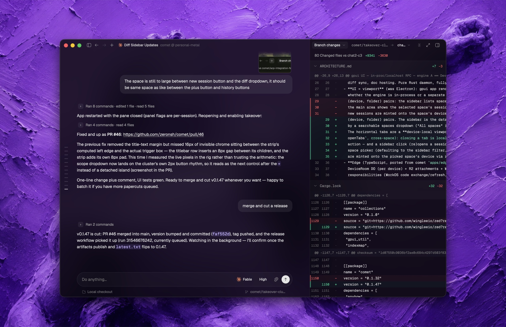

# Zeron

Control your coding agents (Claude Code, Codex, Cursor, Grok, Hermes, Pi,
OMP, Prime Agent, and other local CLI runtimes) locally by default, with
optional multi-device sync.



Every device runs a small engine that stores sessions on that device. A new installation starts in local-only mode without an account or a network connection.

## Install and run locally (Linux)

```bash
curl -fsSL https://zeron.sh/install.sh | sh
zeron status
```

The installer starts the daemon immediately and keeps it running across reboots. No sign-in or sync configuration is required.

Day-to-day:

```bash
zeron status      # local/synced mode and engine status
zeron update      # update to the latest release
zeron daemon start|stop|restart|status
```

## Optional multi-device sync

Sign in only when you want to open your account's synced workspace. Authentication changes the profile selected by the next engine start, so stop the daemon before changing it:

```bash
zeron daemon stop
zeron login
zeron daemon start
```

You can then start an agent on one synced device and follow or drive it from another. An always-on machine such as a VPS can keep those agents working after you close your laptop.

Signing in does not upload, move, or import existing local sessions. Local sessions and their attachments remain under the local profile and reappear when you return to local-only mode:

```bash
zeron daemon stop
zeron logout
zeron daemon start
```

`zeron login` and `zeron logout` refuse to modify credentials while an engine owns the data directory. The desktop app follows the same next-restart profile boundary.

On macOS: use the desktop release, or build `zeron` from source and run `zeron daemon install` to install the launchd service.

## Desktop workflows

The desktop app separates managed Orchestrator chats from local Workers
sessions. Workers remain active when the main window closes and can be reopened
from the macOS menu bar.

In either mode, `Details` shows Workspace, structured To-dos when available,
and account Usage while `Files` explores the selected local checkout with
Material file icons. Opening a file keeps the chat visible and uses the same
side panel as Terminal and Git; it supports read-only previews for Markdown,
source code, HTML, PDF, images, CSV/TSV, and Excel workbooks. Files for a
checkout hosted on another device must be opened on that host device.

---

Developing or curious how it works? [](https://deepwiki.com/zeronsh/comet) or check out [ARCHITECTURE.md](ARCHITECTURE.md).

Licensed under the [MIT License](LICENSE).
