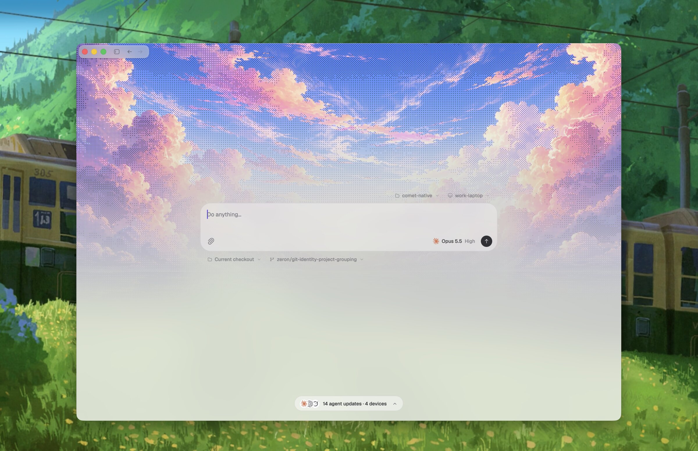

# Zeron

Control your coding agents (Claude Code, Codex, Cursor, Devin, Grok, Hermes,
Pi, Antigravity, OMP, Prime Agent, and other local CLI runtimes) locally by
default, with optional multi-device sync.

*English | [简体中文](README.zh-CN.md) | [한국어](README.ko.md) | [日本語](README.ja.md)*



## Desktop app

This repository is the Comet fork; build it from source to retain its Workers and OMP features. Upstream Zeron desktop binaries are available from [GitHub Releases](https://github.com/zeronsh/zeron/releases/latest):

- **macOS** — `zeron-<version>-macos-arm64.dmg`
- **Windows** — `zeron-<version>-windows-x86_64-setup.exe`
- **Linux** — `zeron-<version>-linux-<arch>.tar.gz`, then run its `install.sh`

No account or network connection is needed; sessions stay on your device. The fork enables app updates only when its own release feed is configured.

## Headless (CLI)

For servers and other machines without a display, such as a VPS that keeps agents running after you close your laptop. Build this fork from source and run `zeron headless`. The following Linux installer installs upstream Zeron:

```bash
curl -fsSL https://zeron.sh/install.sh | sh
zeron status
```

The installer starts the engine as a background service that survives reboots.

```bash
zeron status      # local/synced mode and engine status
zeron update      # update to the latest release
zeron daemon start|stop|restart|status
```

## Multi-device sync (optional)

Sign in to start an agent on one device and follow or drive it from another:

```bash
zeron daemon stop
zeron login        # or: zeron logout to return to local-only
zeron daemon start
```

You can then start an agent on one synced device and follow or drive it from another. An always-on machine such as a VPS can keep those agents working after you close your laptop.

Devices signed in to the same synced account are trusted with remote workspace access. A device controlling a workspace on another device can list, read, and write its files; enabling `Show ignored files` also makes gitignored files such as `.env` available remotely. `.git` is always excluded. Only sign in devices you trust with the full contents of your workspaces.

Signing in does not upload, move, or import existing local sessions. Local sessions and their attachments remain under the local profile and reappear when you return to local-only mode:

```bash
zeron daemon stop
zeron logout
zeron daemon start
```

`zeron login` and `zeron logout` refuse to modify credentials while an engine owns the data directory. The desktop app follows the same next-restart profile boundary.

On macOS: use the desktop release, or build `zeron` from source and run `zeron daemon install` to install the launchd service.

On Windows: extract the portable release ZIP and run `zeron.exe`. Keep `zeron-update.json` beside it for in-app updates. See the [development notes](docs/reference/windows-development.md) for source builds.

## Desktop workflows

The desktop app separates managed Orchestrator chats from local Workers
sessions. Workers remain active when the main window closes and can be reopened
from the macOS menu bar.

In Workers, use **New project** or **⌘K** to browse and register a local
folder. Confirming selects the project without creating a Space or starting a
Worker; Escape cancels. Base projects contain their local Workers directly,
and linked worktrees appear underneath by branch name with their own Workers.
Confirmed pull requests appear as icons with tooltips on the relevant checkout.

In either mode, `Details` shows Workspace, structured To-dos when available,
and account Usage while `Files` explores the selected local checkout with
Material file icons. Opening a file keeps the chat visible and uses the same
side panel as Terminal and Git; it supports read-only previews for Markdown,
source code, HTML, PDF, images, CSV/TSV, and Excel workbooks. Files for a
checkout hosted on another device must be opened on that host device.

## Upstream sponsors

The upstream project thanks [The Context Company](https://www.thecontextcompany.com/) for sponsoring Zeron and accepts [GitHub sponsorships](https://github.com/sponsors/zeronsh).

---

Developing or curious how it works? [Ask DeepWiki](https://deepwiki.com/zeronsh/zeron) or check out [ARCHITECTURE.md](ARCHITECTURE.md).

Licensed under the [MIT License](LICENSE).
