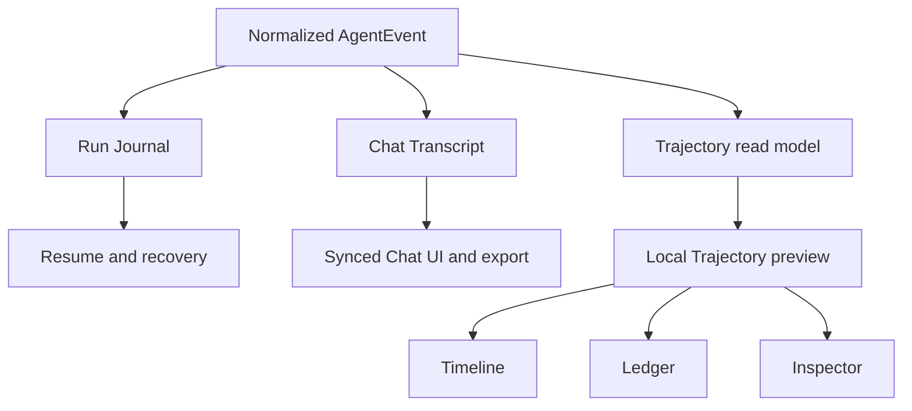

# Comet Chat Trajectory Preview Requirements

## Summary

Add a titlebar Trajectory button beside Capture that opens a device-local observability preview for the selected Chat. The preview reproduces the DeepSeek Harness trajectory surface: a three-lane timeline, event ledger, and technical inspector over every run captured for that Chat on the current device.

---

## Problem Frame

Comet's Chat Transcript is optimized for conversation, synchronization, and privacy. It folds agent events into user-facing parts, omits historical Usage, and bounds tool details before they enter synchronized state. That makes it the wrong source for reconstructing a complete execution trajectory.

The local Run Journal retains the missing events for recovery, but its raw JSONL format contains complete prompts, file contents, and tool payloads. Treating it as a UI API would couple product behavior to recovery storage and expose data the Chat Transcript deliberately removes.

Comet already receives normalized `AgentEvent`s before these two projections diverge. Trajectory needs a third projection with a product-owned, local contract.

---

## Key Decisions

- **Titlebar entry point.** Trajectory opens from a new button beside Capture instead of becoming a primary `Chat | Trajectory` mode.
- **Existing preview system.** Trajectory is a right-pane surface with at most one open surface per Chat; repeated clicks focus the existing surface.
- **Separate local read model.** Trajectory is fed from the same agent events as the Run Journal but does not parse the Run Journal directly and does not enter the Chat Transcript.
- **Always-on capture.** Every local run is captured whether or not the preview is open, so observability is available after a failure.
- **Device-local history.** A Chat's preview combines all runs captured on the current device and marks run boundaries; runs executed elsewhere are not reconstructed locally.
- **Safe-by-default inspection.** Payload and Result are sanitized until the user explicitly reveals the raw value on the executing device.
- **Honest legacy degradation.** Existing journals without per-event timestamps render in sequence order and do not claim exact Duration or Timing.

---

## Actors

- A1. **Chat user:** opens Trajectory, searches and folds events, selects a record, and may reveal a raw local value.
- A2. **Executing device:** captures and retains the Trajectory for runs it executes; it is the only device that can provide raw values for those runs.
- A3. **Agent runtime:** emits the ordered events, identities, usage, status, errors, and timing inputs from which Trajectory is derived.

---

## Requirements

**Entry point and surface lifecycle**

- R1. The titlebar MUST show a Trajectory control beside Capture whenever a Chat is selected.
- R2. Activating the control MUST open the right pane and select that Chat's Trajectory surface.
- R3. A Chat MUST have at most one open Trajectory surface, and repeated activation MUST focus it instead of creating duplicates.
- R4. The control MUST expose an active state while its Trajectory surface is selected.
- R5. Closing the surface MUST stop only its presentation; event capture MUST continue.
- R6. The surface MUST participate in the existing right-pane tab, close, focus, resize, and narrow-viewport takeover behavior.

**Capture and local history**

- R7. The executing device MUST capture Trajectory events for every local run without requiring the preview to be opened first.
- R8. Each captured event MUST preserve stable ordering, event time when observed, run identity, semantic kind, status, and the available turn, step, call, duration, usage, and error correlation data.
- R9. The Trajectory read model MUST remain device-local and MUST NOT enter synchronized Chat state.
- R10. The Trajectory read model MUST remain distinct from both the Run Journal and the Chat Transcript.
- R11. The preview MUST combine all runs for the selected Chat that were captured on the current device and MUST render explicit boundaries between runs.
- R12. History imported from journals without event timestamps MUST use sequence geometry and MUST mark Duration and Timing as unavailable.
- R13. Opening historical data and following a live run MUST converge on the same event ordering and projection behavior.

**Timeline and ledger**

- R14. The preview MUST render a fixed overview with Input, Model, and Tools lanes derived from each event's semantic kind.
- R15. Input MUST cover system, user, and context events; Model MUST cover assistant/model events; Tools MUST cover tool and subordinate-tool events.
- R16. Errors MUST remain visibly distinguishable from successful events in both the timeline and ledger.
- R17. The toolbar MUST provide Duration, Turns, Calls, and Search controls with the same meaning as the reference UI.
- R18. Duration MUST switch between equal-width sequence geometry and recorded-duration geometry without presenting missing legacy timing as measured data.
- R19. Turns MUST fold or expand collapsible turns, while Calls MUST fold or expand tool calls under assistant steps.
- R20. The ledger MUST organize records as run, turn, step, and event while preserving chronological order.
- R21. Timeline selection, ledger selection, and inspector content MUST remain synchronized.
- R22. Search or range focus MUST visually de-emphasize nonmatching records without removing their chronological context.
- R23. Large trajectories MUST remain navigable through virtualized rows, stable semantic row identities, and scroll anchoring during live append or historical prepend.
- R24. Live follow MUST continue only while the user remains at the live edge; inspecting older records MUST suspend automatic scrolling without suspending capture.

**Inspector and privacy**

- R25. The selected record MUST open an inspector inside the Trajectory surface rather than using the global Details sidebar.
- R26. The inspector MUST expose Summary, Payload, Result, Schema, and Timing views when the selected event has corresponding data.
- R27. Summary MUST identify the selected record's run, turn, step, hierarchy, status, and error state when available.
- R28. Payload and Result MUST show sanitized representations by default.
- R29. The user MAY explicitly reveal the raw Payload or Result only on the device that captured the event.
- R30. Revealing raw data MUST be temporary presentation state and MUST NOT change synchronized state, Chat Transcript Export, or the stored sanitized representation.
- R31. Unavailable fields MUST render as unavailable rather than as empty, zero, or estimated values.

---

## Key Flows

- F1. Open a Chat's Trajectory
  - **Trigger:** A1 activates Trajectory beside Capture.
  - **Actors:** A1.
  - **Steps:** Comet opens the right pane, reuses or creates the selected Chat's surface, loads local history, and follows new events.
  - **Outcome:** The latest local trajectory is visible without changing capture state.
  - **Covered by:** R1-R6, R11, R13.

- F2. Observe a live run
  - **Trigger:** A3 emits events for a run on A2.
  - **Actors:** A2, A3.
  - **Steps:** Events enter the local read model, update the snapshot, and append to the timeline and ledger while live follow remains eligible.
  - **Outcome:** The user sees the execution evolve without polling or reopening the surface.
  - **Covered by:** R7-R10, R13-R24.

- F3. Inspect one operation
  - **Trigger:** A1 selects a timeline span or ledger row.
  - **Actors:** A1, A2.
  - **Steps:** Timeline and ledger synchronize selection, the inspector opens, and available Summary, Payload, Result, Schema, and Timing views bind to that record.
  - **Outcome:** The selected operation can be audited without losing its chronological context.
  - **Covered by:** R21, R25-R31.

- F4. Reveal a raw value
  - **Trigger:** A1 explicitly requests the raw Payload or Result for a local record.
  - **Actors:** A1, A2.
  - **Steps:** Comet resolves the raw value through a privileged local capability and reveals it only in the current presentation state.
  - **Outcome:** Deep debugging is possible without syncing or exporting the raw value.
  - **Covered by:** R28-R30.

- F5. Open legacy history
  - **Trigger:** A1 opens a Chat whose earlier local journal lacks event timestamps.
  - **Actors:** A1, A2.
  - **Steps:** Comet projects available events in sequence order, marks run boundaries where recoverable, and disables exact Duration and Timing claims for affected records.
  - **Outcome:** Historical events remain useful without fabricated telemetry.
  - **Covered by:** R11-R13, R18, R31.

---

## Acceptance Examples

- AE1. **Covers R2-R5.** Given a selected Chat with no Trajectory surface, when the user activates Trajectory twice, then the first activation opens one surface and the second focuses that same surface without creating another.
- AE2. **Covers R5, R7.** Given a live run, when the user closes the Trajectory surface and later reopens it, then events emitted while closed are present.
- AE3. **Covers R11.** Given two runs of the same Chat captured on this device, when Trajectory opens, then both runs appear in order with an explicit boundary.
- AE4. **Covers R12, R18, R31.** Given legacy events without timestamps, when Duration is active, then those events remain sequence-based and Timing is shown as unavailable rather than zero or estimated.
- AE5. **Covers R21-R22.** Given a selected tool span, when the corresponding ledger row is outside the viewport, then selection brings that row into view and dims unrelated records without changing their order.
- AE6. **Covers R24.** Given a live run whose preview is following the end, when the user scrolls into older events, then new events continue to be captured but the viewport does not jump back to the end.
- AE7. **Covers R28-R30.** Given a tool result containing a sensitive value, when the inspector first opens, then the value is sanitized; when the user reveals it, then it appears locally and remains absent from synchronized state and export.
- AE8. **Covers R29, R31.** Given a run executed on another device, when this device cannot resolve its raw event, then Reveal reports the value as unavailable rather than substituting synchronized transcript content.

---

## Success Criteria

- The real GPUI app reproduces the reference interaction model: titlebar entry, right-pane overview, ledger, synchronized selection, and internal inspector.
- A new local run remains fully inspectable after its preview was closed for the entire execution.
- Legacy history never displays fabricated duration or timing.
- Raw values never enter synchronized Chat state or Chat Transcript Export.
- A trajectory large enough to trigger virtualization remains scrollable and selection-stable during live updates.

---

## Scope Boundaries

- CLI Worker trajectories are deferred.
- Cross-device Trajectory synchronization is excluded from this capability.
- Raw payload export is excluded.
- Multiple Trajectory surfaces for the same Chat are excluded.
- Capture is not a per-Chat toggle and is not controlled by opening or closing the preview.
- The existing Capture control and global Details sidebar retain their current responsibilities.
- Timing reconstruction for legacy journals is not attempted.

---

## Dependencies and Assumptions

- Normalized `AgentEvent`s remain available at the local engine seam before Chat Transcript folding.
- The right-pane surface system remains the owner of preview tabs, focus, close, resize, and narrow-viewport takeover behavior.
- The executing device can resolve raw event values through a local privileged capability without publishing them to synchronized state.
- Local retention, size bounds, corruption recovery, and schema migration for the Trajectory read model must be settled during planning.
- The repository's documented `no-mistakes` push gate lacks `.no-mistakes.yaml`; publication requires restoring an enforceable gate or obtaining an explicitly approved equivalent.

---

## Outstanding Questions

### Deferred to Planning

- Which existing icon best distinguishes Trajectory from Capture, Diff, Terminal, and Details?
- What local storage format, retention bound, and compaction policy satisfy long-running Chats?
- Does raw reveal resolve an opaque source reference or use a separately protected raw envelope?
- Which keyboard shortcut, if any, opens or focuses the selected Chat's Trajectory surface?
- How should the preview divide width between ledger and inspector at each existing right-pane breakpoint?

---

## Sources and Research

- `CONTEXT.md` defines Chat, Session, Chat Transcript, Run Journal, and Trajectory.
- `docs/adr/0004-trajectory-uses-a-separate-local-read-model.md` records the local read-model boundary.
- `crates/proto/src/agent.rs` defines normalized agent events, tool execution metadata, and usage.
- `crates/engine/src/sessions.rs` owns event publication, journaling, and synchronized transcript folding.
- `crates/engine/src/run_journal.rs` defines the raw local JSONL journal and its legacy sequence-only envelope.
- `crates/doc/src/parts.rs` sanitizes tool data and omits Usage from synchronized Chat state.
- `crates/ui/src/shell.rs` and `crates/ui/src/shell/tabs.rs` own the Capture control and right-pane surfaces.
- `crates/ui/src/transcript.rs` and `crates/ui/src/turn_steps.rs` provide existing virtualization, scroll anchoring, and stable folding behavior.
- Reference behavior was extracted from [`deepseek-ai/deepseek-harness`](https://github.com/deepseek-ai/deepseek-harness/tree/0a53fb55bea101816fa226bb964ae2bed71c343b), MIT license.
