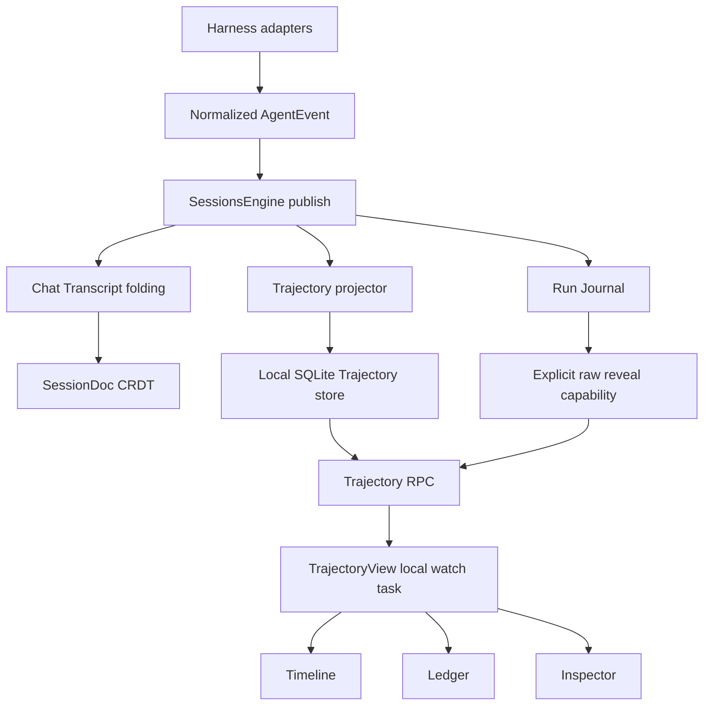
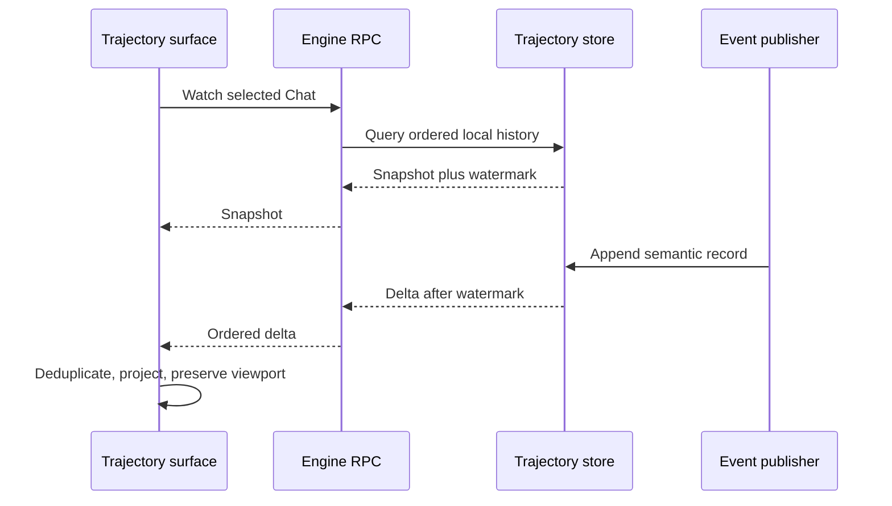
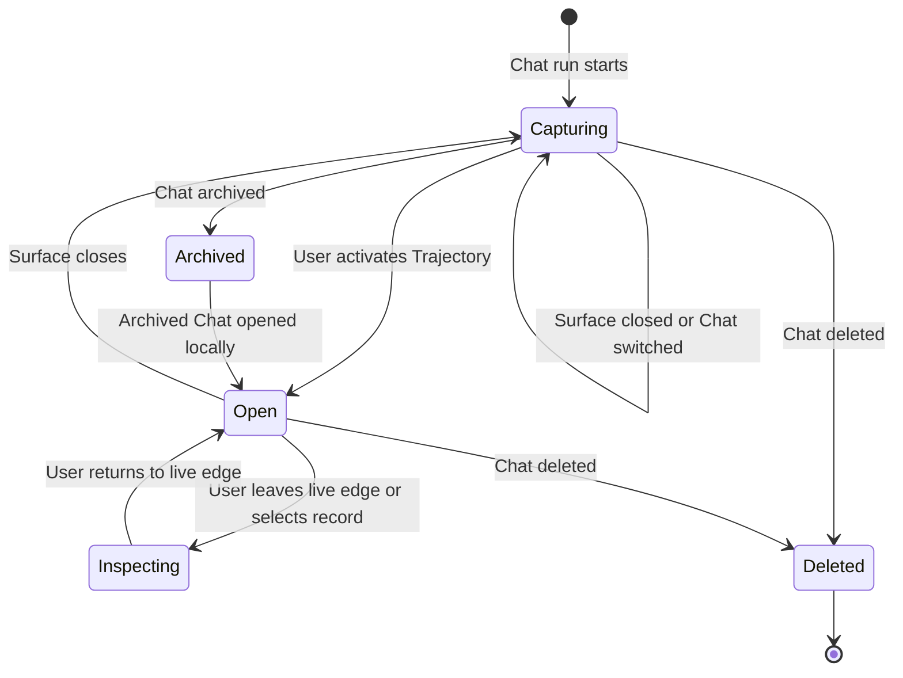

# feat: Add Chat Trajectory preview

## Summary

Add an always-captured, device-local Trajectory read model and expose it through a titlebar button beside Capture. The button opens one right-pane surface per Chat containing the DeepSeek-style three-lane timeline, virtualized ledger, and safe-by-default inspector.

---

## Problem Frame

The synchronized Chat Transcript is intentionally incomplete for technical observability: tool data is bounded, Usage is omitted, and privacy-sensitive inputs never enter CRDT state. The Run Journal retains raw events for recovery, but its JSONL format is not a product API and contains data that must not render by default.

`SessionsEngine::publish` already sees normalized `AgentEvent`s before recovery and synchronized presentation diverge. A third projection at that seam can preserve local execution structure without changing Chat sync, export, or recovery contracts.

---

## Actors

- A1. **Chat user:** opens and navigates the preview, selects records, and explicitly reveals a raw local field when needed.
- A2. **Executing device:** owns capture, persistence, raw lookup, and local availability for runs it executed.
- A3. **Agent runtime:** emits the ordered lifecycle, model, tool, usage, status, and error events projected into Trajectory.

---

## Requirements

The origin document remains authoritative. This table carries every origin requirement into implementation units.

| ID | Implementation requirement | Units |
|---|---|---|
| R1 | Show Trajectory beside Capture for a selected Chat. | U5 |
| R2 | Open and select the Chat's right-pane Trajectory surface. | U5 |
| R3 | Keep at most one Trajectory surface per Chat. | U5 |
| R4 | Reflect the selected surface in the button's active state. | U5 |
| R5 | Closing presentation must not stop capture. | U2, U3, U5 |
| R6 | Reuse right-pane tab, resize, close, and takeover behavior. | U5 |
| R7 | Capture every local run without an open preview. | U2 |
| R8 | Preserve ordering, observed timing, identity, correlation, status, usage, and errors. | U1, U2 |
| R9 | Keep Trajectory device-local and outside synchronized Chat state. | U2, U3 |
| R10 | Keep Trajectory distinct from Run Journal and Chat Transcript. | U1, U2 |
| R11 | Combine all runs captured locally for a Chat with run boundaries. | U1, U2, U4 |
| R12 | Import legacy history as sequence-only without fabricated timing. | U1, U2, U4 |
| R13 | Reconcile historical snapshot and live updates under one ordering contract. | U2, U3, U4 |
| R14 | Render fixed Input, Model, and Tools lanes. | U1, U4 |
| R15 | Classify system/user/context, assistant/model, and tool/subtool records consistently. | U1, U4 |
| R16 | Distinguish errors across timeline and ledger. | U1, U4 |
| R17 | Provide Duration, Turns, Calls, and Search. | U4 |
| R18 | Switch sequence and recorded-duration geometry honestly. | U1, U4 |
| R19 | Fold turns independently from assistant tool calls. | U1, U4 |
| R20 | Organize the ledger as run, turn, step, and event in chronological order. | U1, U4 |
| R21 | Synchronize timeline, ledger, and inspector selection. | U4 |
| R22 | De-emphasize nonmatching records without removing context. | U4 |
| R23 | Preserve navigation through virtualization and stable scroll anchors. | U4 |
| R24 | Suspend auto-follow when the user leaves the live edge without suspending capture. | U3, U4 |
| R25 | Keep the inspector inside Trajectory rather than the global Details sidebar. | U4 |
| R26 | Expose Summary, Payload, Result, Schema, and Timing views when applicable. | U1, U4 |
| R27 | Show run, turn, step, hierarchy, status, and error state in Summary. | U1, U4 |
| R28 | Sanitize Payload and Result by default. | U1, U2, U4 |
| R29 | Reveal raw values only through a local explicit action. | U2, U3, U4 |
| R30 | Keep revealed raw values ephemeral and outside sync, export, and sanitized storage. | U2, U3, U4 |
| R31 | Represent missing data as unavailable rather than empty, zero, or estimated. | U1, U4 |

---

## Key Technical Decisions

- **KTD1 — SQLite read model in the engine:** use the existing workspace `rusqlite` dependency and the `DocsStore` WAL/migration conventions for indexed local history, but isolate one ordered writer from independent readers because `SessionsEngine::publish` is synchronous. JSONL would force full scans for paging, search, ranges, and multi-run lookup; Loro is excluded by ADR 0004.
- **KTD2 — Single ordered capture seam:** project semantic records from `SessionsEngine::publish`, after the Run Journal has assigned sequence identity and before Chat Transcript folding drops data. Capture remains active with zero UI subscribers.
- **KTD3 — Fail-open observability:** a Trajectory write or migration failure must not fail an agent run, block Run Journal recovery, or mutate synchronized Chat state. The store records or reports a degraded range so the UI does not imply completeness.
- **KTD4 — Sanitized rows plus opaque raw references:** SQLite stores product-safe summaries and correlation metadata, not duplicate raw blobs. The reference identifies Chat, source sequence, and nested subagent/tool identity. A local-only engine capability resolves one field from Run Journal; absence or ownership mismatch returns unavailable.
- **KTD5 — Snapshot watermark plus deltas:** the watch protocol returns an ordered snapshot with a last-sequence watermark, then only deltas after that watermark. The client deduplicates by stable record identity during the snapshot-to-stream handoff.
- **KTD6 — Semantic persistence, throttled partial presentation:** persist lifecycle edges, completed model/tool records, usage, and final summaries. Coalesce high-frequency text/reasoning deltas into a partial live record on the existing 120 ms presentation cadence rather than writing one database row per token.
- **KTD7 — Retain with the Chat lifecycle:** keep all sanitized local runs while the Chat exists and preserve them when archived. Observe the authoritative workspace Chat set so local, synchronized, and Space cascade deletion all remove rows. No age/run-count pruning enters this scope.
- **KTD8 — Lazy, idempotent legacy projection:** first access to a Chat may project its legacy journal into sequence-only records. A source fingerprint/watermark prevents duplicate imports; unrecoverable run boundaries become one labeled legacy run rather than invented segmentation.
- **KTD9 — Internal responsive inspector:** timeline, ledger, and inspector remain one `TrajectoryView`. Wide surfaces split ledger and inspector; narrow surfaces switch the selected record into an internal detail sheet/view with a return path, never the global Details sidebar.
- **KTD10 — Existing shell owns navigation:** extend `RightSurface`, titlebar capability arbitration, and the current per-panel tab map. Do not introduce another pane owner or absolute titlebar positioning.

---

## High-Level Technical Design

### Component topology



Run Journal, Chat Transcript, and Trajectory remain sibling projections with separate contracts. A Trajectory failure never changes the other two branches.

### Snapshot and live-stream handshake



The server establishes the watermark before exposing deltas so an event cannot fall between the historical query and subscription. Duplicate delivery is harmless because records have stable identities.

### Surface and capture lifecycle



Capture belongs to the engine and never follows the surface lifecycle. Archive retains local rows; deletion closes the surface and removes them.

---

## Output Structure

```text
crates/proto/src/
└── trajectory.rs                 # shared record, frame, lane, status, and timing contracts

crates/engine/src/
└── trajectory_store.rs           # SQLite migrations, capture, query, legacy projection, raw reference lookup

crates/ui/src/trajectory/
├── mod.rs                        # public surface entity and module ownership
├── view.rs                       # GPUI entity, RPC watch lifecycle, and component assembly
├── model.rs                      # pure layout, fold, search, selection, and partial reconciliation
├── timeline.rs                   # three-lane overview and geometry
├── ledger.rs                     # virtual rows and viewport anchoring
├── inspector.rs                  # Summary/Payload/Result/Schema/Timing and raw reveal state
└── toolbar.rs                    # Duration/Turns/Calls/Search controls
```

Final file splits may adjust during implementation, but the ownership boundaries must remain: shared contracts in proto, persistence/service in engine/RPC, and presentation state in UI.

---

## Implementation Units

### U1. Define Trajectory contracts and pure projections

**Goal:** Establish one typed vocabulary for captured records, timing modes, lanes, statuses, run boundaries, sanitized inspector data, and snapshot/delta reconciliation.

**Requirements:** R8, R10-R12, R14-R20, R26-R28, R31; supports F2, F3, F5 and AE3-AE5.

**Dependencies:** None.

**Files:**
- Create `crates/proto/src/trajectory.rs` with inline unit tests.
- Modify `crates/proto/src/lib.rs` to expose the module.
- Modify `crates/proto/AGENTS.md` to document ownership and unit coverage.

**Approach:**
- Define stable record identity around Chat, run, source sequence, and semantic sub-record identity without reusing UI row indexes.
- Represent timing as recorded or sequence-only; missing start/end/duration remains `None` through formatting.
- Keep raw content out of shared snapshots. Carry a local opaque reference and a sanitized presentation value.
- Implement pure lane classification, error/status precedence, run/turn/step grouping, partial-to-final replacement, and snapshot/delta deduplication.
- Preserve provider/tool-specific data as typed optional fields only when the generic inspector consumes it; opaque extras must not become an unbounded dump.

**Execution note:** Implement the new observable contracts test-first because every downstream layer depends on their ordering and privacy semantics.

**Patterns to follow:**
- `crates/proto/src/agent.rs` for normalized event enums and optional metadata.
- `crates/proto/src/view.rs` for pure view derivations and inline test style.
- `crates/doc/src/parts.rs` for safe preview bounds and tool sanitization policy.

**Test scenarios:**
1. Map system, user, context, assistant/model, tool, and subtool records to the correct lane.
2. Give error status precedence over the semantic color without losing the original kind.
3. Correlate tool call and result by stable call identity across interleaved calls.
4. Preserve two runs for one Chat with an explicit boundary and independent sequence domains.
5. Covers AE4. Project a record with no timestamp as sequence-only; formatting returns unavailable rather than `0 ms`.
6. Reconcile a partial assistant record into its final record without duplicate ledger rows.
7. Apply the same delta twice and keep one record.
8. Sanitize file writes, tool inputs, and tool results within the existing preview budgets while retaining schema/status metadata.

**Verification:** Pure tests prove classification, grouping, timing absence, sanitization, and idempotent reconciliation without engine or GPUI state.

**must_haves:**
- **Truths:** Every visible record has stable identity and lane; missing timing stays unavailable; sanitized snapshots contain no raw sensitive body.
- **Artifacts:** `crates/proto/src/trajectory.rs` owns the cross-layer contract and its pure tests; `crates/proto/src/lib.rs` exports it.
- **Key links:** `pub mod trajectory`; `TrajectoryTimingMode`; `TrajectoryLane`; `TrajectoryRecord`; `source_seq`.

### U2. Add the device-local store and always-on capture

**Goal:** Persist sanitized Trajectory history for every local run without coupling capture to UI presence or allowing observability failures to interrupt the agent.

**Requirements:** R5, R7-R13, R28-R30; supports F2, F5 and AE2-AE4, AE7-AE8.

**Dependencies:** U1.

**Files:**
- Create `crates/engine/src/trajectory_store.rs` with migrations and inline unit/integration-style tests.
- Modify `crates/engine/src/lib.rs` to own the store module.
- Modify `crates/engine/src/sessions.rs` to project published events and manage run lifecycle.
- Modify `crates/engine/src/workspace_host.rs` or its owning Chat watcher to observe local and synchronized Chat removal.
- Modify `crates/engine/AGENTS.md` to record the storage/capture contract and coverage.

**Approach:**
- Open a profile-scoped SQLite database using the WAL, busy-timeout, transaction, and migration conventions in `DocsStore`.
- Use a dedicated bounded, nonblocking capture queue and single-writer connection; independent read connections serve RPC queries and legacy reads. Queue saturation marks a degraded interval instead of blocking publish. Do not share `DocsStore`'s single `Mutex<Connection>` shape across the publish hot path and readers.
- Project semantic records at publish time and batch durable writes without persisting token-level rows.
- Store sanitized fields and an opaque source reference containing Chat, source sequence, and nested subagent/tool identity where applicable; do not store raw payload/result copies.
- Persist a completeness/watermark marker. On write failure, keep Run Journal and Chat execution live, expose a degraded interval, and retry later without silently claiming a complete trajectory.
- Lazily project legacy journal history once per source fingerprint. Missing timestamps produce sequence-only records; corrupt trailing lines stop at the last valid prefix.
- Retain rows through archive and engine restart. Observe the workspace Chat set so local RPC deletion, synchronized deletion, and Space cascade deletion all remove rows.
- Mark an unfinished run interrupted on recovery without fabricating completion time or tool results.

**Execution note:** Start with store contract tests in a temporary profile, including crash/reopen and failure isolation, before attaching capture to `SessionsEngine`.

**Patterns to follow:**
- `crates/sync/src/store.rs` for SQLite WAL, migrations, transactions, and temporary-store tests.
- `crates/engine/src/run_journal.rs` for monotonic source sequence, tail recovery, and owner-checked reverse lookup.
- `crates/engine/src/sessions.rs` for publish ordering and `crates/engine/src/workspace_host.rs` for the authoritative Chat-set watcher used by every deletion path.

**Test scenarios:**
1. Covers F2 / AE2. Emit a complete run with no RPC subscriber, reopen the store, and recover every semantic record in order.
2. Capture two runs for one Chat and query both with explicit boundaries.
3. Close all UI-equivalent subscriptions, emit additional events, and confirm capture is unchanged.
4. Fail a Trajectory transaction and confirm Run Journal append and agent event publication continue while the store reports a degraded range.
5. Reopen after an active run ends abruptly and mark it interrupted with no invented duration.
6. Persist a tool call without a result and expose it as unsettled/unavailable rather than dropping it.
7. Covers AE4. Lazily import a legacy journal twice and produce one sequence-only projection with no duplicate rows.
8. Import a journal with a corrupt tail and retain only the valid prefix.
9. Archive a Chat and retain its rows; delete the Chat and remove them.
10. Verify stored snapshots contain sanitized previews and opaque references but no known raw secret fixture.
11. Verify no Trajectory record enters `SessionDoc` or the transcript/export projection.
12. Run RPC queries while capture writes continue and confirm readers do not hold the single-writer connection or stall ordered publish.
13. Remove a Chat through local deletion, synchronized deletion, and Space cascade paths; each path removes the same Trajectory rows.
14. Capture a nested subagent tool event and preserve enough opaque identity to resolve the exact raw source later.

**Verification:** Temporary-profile tests prove migration, persistence, restart, legacy import, cleanup, fail-open behavior, and isolation from synchronized state.

**must_haves:**
- **Truths:** Capture runs without UI; restart preserves history; Trajectory failure never fails the Chat run; sync/export contain no Trajectory data.
- **Artifacts:** `crates/engine/src/trajectory_store.rs` provides migrations, separate writer/reader access, capture, queries, legacy projection, health, and deletion; `crates/engine/src/sessions.rs` feeds normalized events; the workspace Chat watcher owns cleanup.
- **Key links:** `trajectory_store`; `SessionsEngine::publish`; `RunJournal`; `SequenceOnly`; `degraded`.

### U3. Expose snapshot, deltas, and narrow raw reveal over RPC

**Goal:** Deliver ordered local history and live updates while keeping raw lookup explicit, ephemeral, local-only, and device-owned.

**Requirements:** R9, R13, R24, R29-R31; supports F1-F4 and AE5-AE8.

**Dependencies:** U1, U2.

**Files:**
- Modify `crates/rpc/src/lib.rs` with Trajectory method/frame contracts and protocol tests.
- Modify `crates/engine/src/rpc.rs` with watch, bounded paging, local-only routing, and raw reveal handlers plus handler tests.
- Modify `crates/rpc/AGENTS.md` and `crates/engine/AGENTS.md` for protocol and coverage contracts.

**Approach:**
- Add a streaming watch that establishes the subscription/watermark before or atomically with the history query, then emits snapshot followed by ordered deltas.
- Keep replay frames bounded. Use cursor/page frames when retained history exceeds one frame without changing the snapshot-plus-delta ordering contract.
- Deduplicate records by stable identity and reject/regap noncontiguous deltas rather than silently reordering them.
- Add one unary raw-reveal capability scoped to Chat, record, and field. Resolve its opaque source reference against local ownership and return unavailable when absent.
- Mark both Trajectory methods local-only so they cannot be forwarded through device/edge routing; enforce an ownership guard on every reveal.
- Perform sequential Run Journal parsing through `spawn_blocking` with line-size limits so raw lookup cannot block async RPC dispatch.
- Treat malformed parameters, missing Chats, foreign-device records, deleted Chats, nested subagent mismatches, and stale references as typed unavailable/error states that do not affect the watch stream.

**Execution note:** Add protocol and handler tests before UI wiring; the snapshot-to-delta handoff and privacy boundary are cross-layer contracts.

**Patterns to follow:**
- `crates/rpc/src/lib.rs` for typed methods, frame envelopes, and service traits.
- `crates/engine/src/rpc.rs` for streaming replies, `FETCH_TOOL_INPUT` blocking-file lookup, ownership checks, and the local-only method table.
- `crates/rpc/tests/device_room.rs` for subscription cancellation and stream behavior.

**Test scenarios:**
1. Subscribe during an append and receive every record exactly once across snapshot and delta frames.
2. Reconnect after a watermark and receive only missing records.
3. Send duplicate/out-of-order deltas and force deterministic deduplication or explicit re-snapshot rather than duplicate rows.
4. Close the UI subscription and confirm engine capture/store writes continue.
5. Covers AE7. Reveal a local raw fixture and confirm the raw string exists only in the unary response, not snapshot, SessionDoc, or export.
6. Covers AE8. Reveal a foreign-device or missing source and receive explicit unavailable.
7. Resolve a nested subagent tool record using source sequence plus parent/call identity and reject a mismatched owner.
8. Verify Trajectory methods are absent from the forwardable RPC set and cannot cross devices.
9. Parse a large raw journal through the blocking worker with line bounds while another async RPC remains responsive.
10. Delete a Chat during an active watch and close the stream with a typed terminal state.
11. Corrupt or fail the Trajectory store and return a degraded snapshot state while the engine remains responsive.

**Verification:** Protocol and engine tests prove framing, atomic handoff, cancellation, local-only routing, nonblocking raw lookup, raw isolation, and typed failure behavior.

**must_haves:**
- **Truths:** A client can receive coherent history plus live updates; dropping a watch stops delivery only; raw reveal cannot be forwarded or persisted by the service.
- **Artifacts:** `crates/rpc/src/lib.rs` defines the wire contract; `crates/engine/src/rpc.rs` serves bounded local history and owner-checked raw reveal.
- **Key links:** `WatchTrajectory`; `RevealTrajectoryRaw`; `last_seq`; `RpcReply::Stream`; `spawn_blocking`; `local_only`.

### U4. Build the Trajectory surface, timeline, ledger, and inspector

**Goal:** Reproduce the reference observability interaction inside one responsive GPUI surface over the shared Trajectory snapshot.

**Requirements:** R11-R31; supports F1-F5 and AE3-AE8.

**Dependencies:** U1, U3.

**Files:**
- Create `crates/ui/src/trajectory/mod.rs`.
- Create `crates/ui/src/trajectory/view.rs` to own the GPUI entity, watch task, and component assembly.
- Create `crates/ui/src/trajectory/model.rs` with pure state/view-model tests.
- Create `crates/ui/src/trajectory/timeline.rs` with pure geometry tests.
- Create `crates/ui/src/trajectory/ledger.rs` with folding, search, selection, and viewport tests.
- Create `crates/ui/src/trajectory/inspector.rs` with sanitization/reveal state tests.
- Create `crates/ui/src/trajectory/toolbar.rs` with control-state tests.
- Modify `crates/ui/src/capture.rs` with capture-gated core Trajectory fixtures and gating tests so U4 can be inspected before shell integration.
- Modify `crates/ui/src/lib.rs` and `crates/ui/AGENTS.md` to register and document the module.

**Approach:**
- Keep the RPC watch task and mutable snapshot inside `TrajectoryView`; `AppState` supplies the engine connection but does not become a global cache for an on-demand right-pane surface.
- Keep a pure `TrajectoryViewModel` as the authority for run/turn/step groups, fold state, selected record, search matches, range focus, timeline mode, live-edge state, and ephemeral revealed values.
- Derive three timeline lanes from shared proto classification. Sequence mode uses equal operation widths; Duration mode uses recorded values and leaves sequence-only legacy segments visibly unavailable.
- Split assistant timing into TTFT/decoding only when all required timestamps are valid and ordered.
- Reuse GPUI virtual-list and `ViewportAnchor` concepts with stable record IDs. Prepending history and appending live records must preserve the user's anchor unless live-follow remains active.
- Make Turns and Calls independent fold domains. Search/range focus dims nonmatches without rebuilding chronology.
- Keep Summary, Payload, Result, Schema, and Timing inside the surface. Raw reveal state lives only in the view entity and clears on close, record change, profile change, or Chat deletion.
- Use split ledger/inspector at sufficient width and an internal detail view/sheet at narrow width; the global Details sidebar remains untouched.
- Render explicit empty, loading, degraded, sequence-only, interrupted, unsettled, unavailable-raw, and no-search-result states.

**Execution note:** Implement pure model and geometry tests before GPUI rendering; visual render code has no reliable headless harness in this repo.

**Patterns to follow:**
- `crates/ui/src/transcript.rs` for `list(...)`, stable viewport anchors, live-edge suspension, and scrolling a selected row into view.
- `crates/ui/src/turn_steps.rs` for independent turn/tool folding and stable activity identity.
- `crates/ui/src/changes.rs` for a complex right-pane surface with toolbar, loading/error states, and retained local state.
- DeepSeek Harness `ui-trajectory` behavior at commit `0a53fb55b` for lane semantics and synchronized selection, not its React implementation.

**Test scenarios:**
1. Derive Input, Model, and Tools spans with error override and stable ordering.
2. Switch Sequence to Duration and preserve selection/range; sequence-only segments remain unavailable.
3. Reject invalid TTFT ordering and render no negative duration.
4. Fold all turns without folding calls, then fold calls without altering turn state.
5. Covers AE5. Select an offscreen timeline span and resolve the matching virtual ledger row and inspector record.
6. Apply search/range focus and dim nonmatches without removing run boundaries or changing record order.
7. Covers AE6. Scroll away from the live edge, append records, and preserve the viewport while the unread/live count advances.
8. Prepend historical rows and preserve the anchored record and pixel offset.
9. Replace a partial assistant/tool record with final data without duplicate rows or jumpy identity.
10. Render interrupted run, orphan tool call, missing result, degraded store, and unavailable raw states.
11. Covers AE7. Keep sanitized Payload/Result visible by default, reveal one raw field temporarily, then clear it when the surface closes or selection changes.
12. Lay out wide split and narrow internal-detail states without invoking the global Details sidebar.
13. Capture knobs remain inert without `ZERON_UI_CAPTURE=1` and seed populated, legacy, error-selected, and narrow core states when enabled.

**Verification:** Pure tests close model, geometry, folding, selection, and viewport contracts; the real GPUI smoke in U6 closes visual and interaction behavior.

**must_haves:**
- **Truths:** Users can navigate the exact three-lane/ledger/inspector model; selection stays synchronized; large/live histories do not steal the viewport; sensitive data is hidden until revealed.
- **Artifacts:** `crates/ui/src/trajectory/` owns the complete surface and its pure behavioral tests; `crates/ui/src/lib.rs` registers it.
- **Key links:** `TrajectoryView`; `TrajectoryViewModel`; `TrajectoryTimeline`; `TrajectoryLedger`; `TrajectoryInspector`; `auto_follow`; `revealed`.

### U5. Integrate the titlebar button and right-pane surface lifecycle

**Goal:** Make Trajectory a first-class right-pane surface opened by one active-aware control beside Capture, with one surface per Chat.

**Requirements:** R1-R6; supports F1 and AE1-AE2.

**Dependencies:** U3, U4.

**Files:**
- Modify `crates/ui/src/shell.rs` with the surface variant, registry, open/focus/close lifecycle, and lifecycle tests.
- Modify `crates/ui/src/shell/tabs.rs` with the titlebar control and active-state rendering.
- Modify `crates/ui/src/icons.rs` only if an existing registered icon cannot express Trajectory.
- Modify `crates/ui/AGENTS.md` with shell ownership and visual verification coverage.

**Approach:**
- Extend `TitlebarCapabilities` through its pure mode/Chat helper; show the control only for an available Orchestrator Chat.
- Insert a content-sized control immediately beside the existing Capture cluster with the established 6 px gap. Do not use absolute positioning or flexible children in the trailing cluster.
- Extend `RightSurface` and its tab label/content/close/active resolution paths. Register by Chat identity and return the existing surface when activated twice.
- Preserve per-Chat surface state across Chat switches through the existing panel-key tab map. Closing removes the entity/subscription; switching Chats does not destroy the prior Chat's surface state.
- Reuse current right-pane width tween, expand, takeover, drag-reorder, and fallback-active behavior.
- Close the surface when its Chat is deleted. Archive preserves and allows reopening.
- Apply icon tint directly and provide stable control identity, role, label, tooltip, keyboard focus, and selected semantics.

**Execution note:** Characterize the existing Capture/right-pane registration behavior with pure lifecycle tests before extending the enum and titlebar cluster.

**Patterns to follow:**
- `render_orchestrator_capture_button` and `render_session_title_bar` for titlebar geometry.
- `register_worker_surface`, preview surface registration, `close_right_surface`, and `set_right_active` for deduplication and lifecycle.
- `right_pane_takeover_width` and existing tween state for responsive behavior.

**Test scenarios:**
1. Covers AE1. Activate Trajectory twice for one Chat and keep one surface with the second activation focused.
2. Open Trajectory for two Chats and retain one independent surface/state per Chat panel key.
3. Switch Chats and restore each Chat's selected Trajectory tab without crossing records.
4. Close the surface, emit additional model events through the engine fixture, reopen, and observe the complete history.
5. Delete a Chat with an open surface and remove the tab/entity/subscription; archive leaves them available.
6. Verify the control is hidden without a selected Orchestrator Chat and does not appear in Workers mode.
7. Verify active state only for the current Chat's selected Trajectory surface.
8. Exercise narrow takeover, pane expand, drag reorder, and close fallback without changing the Chat column geometry.
9. Verify stable ID, accessibility role/label/value, focus behavior, and direct icon tint.

**Verification:** Shell unit tests prove capability and lifecycle invariants; U6 verifies the real titlebar placement and pane interactions.

**must_haves:**
- **Truths:** The control appears beside Capture for a selected Chat; one click opens/focuses one per-Chat surface; closing presentation never controls capture.
- **Artifacts:** `crates/ui/src/shell.rs` owns surface lifecycle; `crates/ui/src/shell/tabs.rs` owns placement and active state.
- **Key links:** `RightSurface::Trajectory`; `titlebar_capabilities`; `render_orchestrator_capture_button`; `open_trajectory`; `close_right_surface`.

### U6. Add deterministic visual fixtures, real-surface QA, and documentation closure

**Goal:** Prove the complete feature in the native GPUI app under stable seeded states and leave durable ownership/test guidance.

**Requirements:** All, with direct focus on R6, R14-R31 and success criteria; covers every origin acceptance example through behavior or visual evidence.

**Dependencies:** U2-U5.

**Files:**
- Extend the core fixtures in `crates/ui/src/capture.rs` only where the final QA matrix still lacks live, degraded, theme, or multi-Chat coverage.
- Modify `scripts/dev-demo.sh` only if the existing demo cannot seed multi-run/live/legacy/error trajectories through supported data inputs.
- Modify `crates/proto/AGENTS.md`, `crates/engine/AGENTS.md`, `crates/rpc/AGENTS.md`, and `crates/ui/AGENTS.md` with final ownership and Test Coverage Matrix entries.
- Modify `docs/PARITY.md` and `FUNCTIONAL-BASELINE.html` if their inventories cover this titlebar/right-pane capability.

**Approach:**
- Add deterministic capture-only states behind `ZERON_UI_CAPTURE=1`: populated multi-run, live partial, legacy sequence-only, selected tool error with inspector, sanitized/raw-unavailable, narrow layout, and degraded store.
- Never let stale environment variables alter normal product startup.
- Validate the actual app at standard and narrow window sizes. Exercise the titlebar control, surface deduplication, Duration/Turns/Calls/Search, timeline-to-ledger selection, inspector tabs, reveal/clear behavior, live-follow suspension, close/reopen continuity, and Chat switch isolation.
- Capture evidence for dark and light themes where semantic colors, dimming, errors, focus rings, and code payload contrast differ.
- Reconcile DOX ownership and the local Test Coverage Matrix after the final file shape is known.

**Execution note:** This unit is native-surface verification, not a substitute for U1-U5 behavioral tests. Use deterministic seeded states, then a live mock run for streaming behavior.

**Patterns to follow:**
- `crates/ui/src/capture.rs` umbrella gating.
- `scripts/dev-demo.sh --slow` for observable streaming.
- Existing capture/demo patterns for routes, dialogs, uploads, and live voice.

**Test scenarios:**
1. Capture knobs have no effect without `ZERON_UI_CAPTURE=1` and produce each named fixture when enabled.
2. The standard-width surface matches the reference information hierarchy and keeps the inspector inside Trajectory.
3. The narrow surface exposes the selected record through the internal detail state without horizontal clipping.
4. Dark/light semantic colors preserve distinguishable Input, Model, Tools, error, selected, dimmed, and focus states.
5. A slow live run updates partial/final records, suspends follow after manual scroll, and resumes only through an explicit live-edge action.
6. Close the preview for part of a run, reopen it, and observe the events emitted while closed.
7. Switch between two Chats with open Trajectory surfaces and preserve independent state and records.
8. Reveal a raw fixture, change selection/close the surface, and confirm the raw value disappears.

**Verification:** Native GPUI observation confirms layout and interactions at real breakpoints; focused tests and crate checks remain green; DOX and capability inventories describe the shipped ownership and coverage.

**must_haves:**
- **Truths:** The real app matches the confirmed preview placement and observability behavior; deterministic fixtures cover failure/privacy/legacy states; documentation names the final owners and verification tiers.
- **Artifacts:** `crates/ui/src/capture.rs` provides gated visual fixtures; local AGENTS files carry coverage; product inventories reflect the capability where applicable.
- **Key links:** `ZERON_UI_CAPTURE`; `trajectory`; `scripts/dev-demo.sh`; `Test Coverage Matrix`.

---

## Phased Delivery

| Phase | U-IDs | Sections | Delivery | UAT mode | Depends on | Audit state | Audited commit |
|---|---|---|---|---|---|---|---|
| Foundation | U1, U2 | Contracts, capture, SQLite, legacy | Always-on local read model with tested privacy/recovery boundaries | automated | — | pending | — |
| Transport | U3 | RPC service | Coherent snapshot/delta stream and narrow local-only raw reveal | automated | U1, U2 | pending | — |
| Surface | U4, U5 | GPUI view and shell integration | Titlebar-opened per-Chat preview with complete interaction model | automated + human | U3 | pending | — |
| Reality | U6 | Fixtures, native QA, DOX | Real-app evidence across live, legacy, privacy, and responsive states | human | U4, U5 | pending | — |

Only an audit verdict of `passed` with a reachable commit satisfies a dependent phase. Shared files serialize execution but do not create new logical dependencies.

---

## System-Wide Impact

- **Engine latency:** `SessionsEngine::publish` is synchronous. Trajectory uses a dedicated writer path and separate reader connections so RPC snapshots and legacy import never hold the capture connection; token-level rows remain excluded.
- **Disk lifecycle:** a profile gains one local Trajectory database retained with Chat lifecycle. Archive retains rows; an authoritative workspace Chat watcher handles local, synchronized, and Space cascade deletion.
- **Privacy:** sanitized records are queryable by the UI. Opaque raw references include source sequence plus nested subagent/tool identity; raw lookup remains local-only, bounded, and explicit.
- **RPC availability:** sequential Run Journal parsing executes through a blocking worker with line-size guards. It must not occupy async engine dispatch or enter the forwardable method set.
- **Synchronization:** `SessionDoc`, edge transport, multi-device state, and Chat Transcript Export remain unchanged.
- **Recovery:** Run Journal stays authoritative for resume. Trajectory corruption can remove observability but cannot block Chat recovery.
- **UI ownership:** each `TrajectoryView` owns its watch task and ephemeral raw state; `AppState` remains a connection/state source rather than a cache for closed previews.
- **Accessibility and themes:** the new surface adds interactive controls, selection semantics, code-like payload content, and semantic colors that need keyboard and contrast coverage.
---

## Risks and Mitigations

| Risk | Consequence | Mitigation |
|---|---|---|
| SQLite reader/writer contention | Historical queries or legacy import stall synchronous event publication. | Use one ordered writer path plus independent WAL readers; test concurrent query and capture rather than sharing one mutexed connection. |
| Hot-path write overhead | Streaming or tool loops become less responsive. | Persist semantic state transitions, batch transactions, throttle partial presentation, and measure fixture throughput before acceptance. |
| Snapshot/delta race | Missing or duplicated rows when opening live history. | Establish a server watermark, use stable IDs, deduplicate client frames, and test append during subscription. |
| Silent store degradation | UI appears complete after local write failures. | Persist/report completeness markers and show a degraded interval/state; never substitute zeros or hide gaps. |
| Raw data escapes | Secrets enter SQLite snapshots, UI caches, sync, or export. | Store sanitized values plus opaque references; keep methods local-only; unary reveal returns one bounded value and the view clears it on lifecycle changes. |
| Nested subagent lookup ambiguity | A raw reveal resolves the wrong wrapped tool event. | Include source sequence, parent tool identity, and call identity in the opaque reference; owner-check all dimensions. |
| Blocking raw scan | Large JSONL parsing starves async RPC handling. | Resolve through `spawn_blocking` with line-size guards and responsiveness coverage. |
| Run Journal evolution | Raw references become stale after recovery-format changes. | Resolve through a versioned engine adapter, not UI offsets; return unavailable when the source contract cannot resolve safely. |
| Deletion bypass | Sync or Space cascade deletes a Chat without cleaning local Trajectory rows. | Observe the authoritative workspace Chat set instead of relying only on the local `DeleteChat` handler. |
| Legacy ambiguity | Old events appear assigned to invented runs or timing. | Lazy idempotent projection, sequence-only mode, and one labeled legacy run when boundaries are unknowable. |
| Unbounded local growth | Long-lived Chats accumulate many sanitized records. | Tie retention to authoritative Chat deletion and expose database size in diagnostics; any pruning policy requires a later product decision. |
| GPUI layout pressure | Timeline, ledger, and inspector become unusable in a narrow pane. | Reuse takeover widths, test standard/narrow fixtures, and switch inspector presentation inside the surface. |
| Existing active shell work | Concurrent changes conflict in `shell.rs`, tabs, or transcript patterns. | Author the OpenSpec change against current HEAD, declare file ownership per phase, and avoid unrelated shell refactors. |
| Missing push gate config | Publication lacks the documented safety gate. | Restore `.no-mistakes.yaml` or obtain an explicitly approved equivalent before push; implementation and local QA may proceed without publication. |
---

## Scope Boundaries

### In scope

- Main Chat runs captured on the current device.
- Always-on local capture, multi-run history, legacy sequence mode, timeline, ledger, internal inspector, explicit raw reveal, and native GPUI verification.

### Deferred to Follow-Up Work

- CLI Worker trajectories.
- Cross-device Trajectory synchronization.
- Automatic age, run-count, or size-based pruning.
- A dedicated keyboard shortcut.

### Outside this capability

- Exporting raw payloads or Results.
- Replacing Run Journal recovery or Chat Transcript synchronization.
- Multiple Trajectory surfaces for the same Chat.
- Using preview open/close as a capture toggle.
- Estimating missing legacy timing.

---

## Documentation and Operational Notes

- Keep `CONTEXT.md` and ADR 0004 authoritative; implementation docs must use Trajectory, Chat, Session, Chat Transcript, and Run Journal consistently.
- Update the nearest DOX owners and their Test Coverage Matrices after final module boundaries stabilize.
- The OpenSpec change must preserve one phase per dependency cluster and carry each unit's `must_haves`, `files`, and focused verification into phase/task contracts.
- Restore an enforceable push gate before any publication. Do not push to upstream or tag a release as part of this feature.
- Local implementation acceptance requires the real GPUI surface; Rust tests alone cannot prove the visual contract.

---

## Sources and Research

- Origin: `docs/brainstorms/2026-09-01-comet-chat-trajectory-preview-requirements.md`.
- Domain: `CONTEXT.md` and `docs/adr/0004-trajectory-uses-a-separate-local-read-model.md`.
- Event/capture seams: `crates/proto/src/agent.rs`, `crates/engine/src/sessions.rs`, and `crates/engine/src/run_journal.rs`.
- Privacy/sync boundary: `crates/doc/src/parts.rs` and `crates/doc/src/schema.rs`.
- SQLite precedent: `crates/sync/src/store.rs`.
- RPC patterns: `crates/rpc/src/lib.rs` and `crates/engine/src/rpc.rs`; the surface-local watch task follows the entity ownership pattern in `crates/ui/src/changes.rs`.
- GPUI patterns: `crates/ui/src/shell.rs`, `crates/ui/src/shell/tabs.rs`, `crates/ui/src/transcript.rs`, `crates/ui/src/turn_steps.rs`, and `crates/ui/src/changes.rs`.
- Local shell precedent: `docs/superpowers/plans/2026-08-20-cross-mode-titlebar-tools.md`.
- External reference: [`deepseek-ai/deepseek-harness`](https://github.com/deepseek-ai/deepseek-harness/tree/0a53fb55bea101816fa226bb964ae2bed71c343b), MIT license; external findings were load-bearing for lane semantics, toolbar behavior, selection synchronization, and inspector information architecture.
