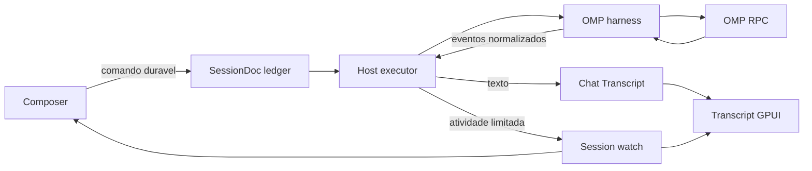
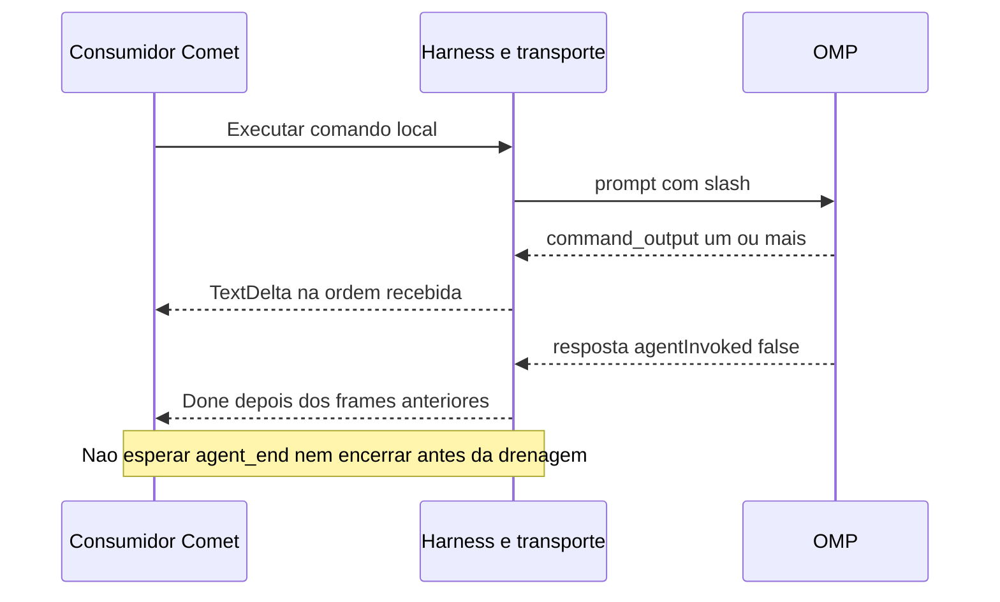
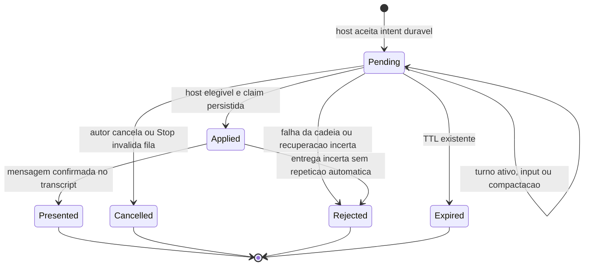
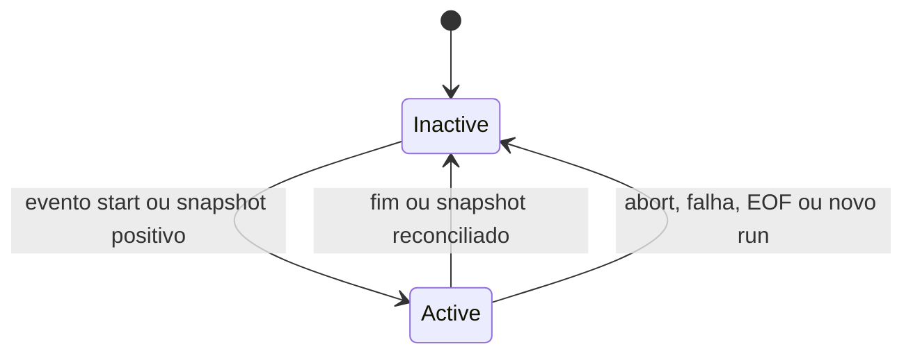

# feat: OMP chat runtime parity

## Summary and Problem Frame

Completar três comportamentos do Chat nativo do Comet: G1, retorno dos comandos slash locais; G4, fila pós-turno distinta de steering; G7, acompanhamento da compactação. O OMP já oferece os mecanismos de execução, mas o transporte, a política de comandos e a projeção visual do Comet não preservam todos esses comportamentos.

Este documento é insumo para uma change OpenSpec. Não autoriza implementação, reinício do app, commit ou publicação.

### Scope Boundaries

- Inclui texto de comandos locais no Chat Transcript, mensagens pós-turno duráveis e atividade de compactação automática/manual na UI nativa GPUI.
- **Exclui toda interface de extensões**, incluindo notificações/widgets/editor de extensões, Fusion e painéis TUI. Não alterar descoberta de extensões nem arquivos globais do OMP.
- Exclui seletores de modelos por papel, perfil, service tier, aprovação, árvore de conversas, imports e colaboração OMP.
- Não reimplementar o parser de comandos slash, o algoritmo de compactação nem o scheduler interno do OMP.
- Manter o lifecycle atual de spawn/resume; transformar o OMP em processo permanentemente aquecido não é pré-requisito nem entrega deste plano.
- Não alterar o terminal dos CLI Workers. Não ampliar o trabalho para as changes concorrentes de Workers, export ou Usage.

---

## Requirements

### Local command results — G1

- R1. `/context`, `/tools` e `/session info`, quando reconhecidos pela versão instalada, exibem sua saída completa no Chat Transcript, sem chamar o modelo para explicar o resultado.
- R2. Um comando com `agentInvoked:false` publica os frames anteriores à resposta antes de encerrar sua execução. Não exige `agent_end`, não duplica o texto e não deixa o Chat preso em Working.
- R3. Texto já exibido sobrevive a reload e export pelo caminho existente do Chat Transcript. Falhas do comando permanecem visíveis, sem virar sucesso vazio ou toast como único registro.

### After-turn queue — G4

- R4. Enviar normalmente durante um turno continua sendo steering. Uma ação separada permite guardar mensagens para execução posterior, sem injetá-las no turno ativo.
- R5. Mensagens pós-turno ficam no ledger durável do Chat em ordem de documento; somente uma começa por vez, após assentamento do turno anterior e fora de compactação ou espera por resposta.
- R6. A UI distingue enfileirada, aceita para execução e apresentada no transcript; múltiplas mensagens e anexos não se sobrescrevem. Cancelar uma pendente usa a regra atual de autoria do comando.
- R7. Stop, erro ou interrupção não iniciam a próxima mensagem automaticamente. Mensagens ainda não despachadas ficam resolvidas com motivo e conteúdo recuperável para reenvio intencional; nenhum efeito de entrega incerta é repetido automaticamente.

### Compaction activity — G7

- R8. Compactação automática e `/compact` manual mostram atividade real e seu desfecho. Não inventar porcentagem, ETA ou contagem de tokens a partir do tempo decorrido.
- R9. Cancelamento, falha, EOF e troca de run removem a atividade antiga. O indicador de contexto só recebe nova medida do runtime; o idle recap não roda enquanto houver compactação ativa.

---

## Key Technical Decisions

- KTD1. **Saída slash reutiliza `TextDelta` e o fold existente.** `command_output` contém texto substantivo, não é `SessionNotice` nem interface de extensão. Isso evita um novo tipo de mensagem persistida, renderer ou export paralelo.
- KTD2. **Consumir eventos enquanto a requisição inicial está pendente.** Hoje `OmpHarness::run` espera `prompt` antes de criar o stream do consumidor. Drenar apenas depois da resposta mantém o risco de preencher os 256 slots e impedir a própria resposta. Preservar a ordem do transporte até o fechamento local, sem sleeps de quietude.
- KTD3. **Fila única no ledger existente, com intent explícito pós-turno.** Introduzir um kind de comando pós-turno, aqui chamado `FollowUp`, que reutiliza `RunRequest`, attachments e o executor de Run quando elegível. Não alterar silenciosamente a semântica atual de `Run`/`Steer`; não criar uma segunda fila em `AppState` ou no subprocesso OMP.
- KTD4. **Não despachar `follow_up` RPC antecipadamente.** Um ACK dessa fila interna do OMP não prova consumo e deixa o conteúdo na RAM do filho. Executar o comando durável no próximo limite elegível dá o comportamento pedido usando o resume já existente. Não prometer manter o mesmo PID entre turnos.
- KTD5. **Controles não esperam atrás do pós-turno.** O seletor do drain deve conseguir alcançar Interrupt, RespondInput e Steer atrás de um FollowUp diferido. FIFO continua entre mensagens pós-turno, e controles com anexos continuam sujeitos à sua própria validação de anexos.
- KTD6. **Elegibilidade vem da execução, não de uma linha da UI.** `Done(Completed)` precisa estar assentado e o handle anterior pronto para reuso ou encerrado. Não usar a mera existência de `turn_id` no transcript como prova de conclusão. Reinício/crash sem conclusão comprovada não libera uma fila antiga.
- KTD7. **Entrada compatível com versões diferentes.** A submissão de FollowUp passa pelo `QueueCommand` endereçado ao host executor, que precisa reconhecer o kind antes de aceitá-lo. Host antigo/inacessível retorna indisponibilidade e mantém o texto recuperável; nunca converter para Run ou Steer como fallback. Leitores antigos já descartam entries desconhecidas individualmente, sem renomear containers CRDT.
- KTD8. **Compactação é atividade da Session.** Normalizar lifecycle no harness; projetar apenas metadados limitados em campo opcional da Session, pelo watch existente. Não persistir o resumo interno da compactação, copiar contexto cru ou gerar uma mensagem de assistente por evento de progresso. Tratar o novo evento interno antes do fan-out para consumidores antigos.
- KTD9. **Compactação manual não pressupõe eventos automáticos.** A fonte local mostra `compact()` sem o par `auto_compaction_start/end`. Observar `get_state.isCompacting` enquanto uma requisição local estiver em curso, com sondagem limitada a essa execução; reconciliar na resposta e no encerramento. Não manter polling de processos ociosos nem interpretar texto de aviso para detectar estado.
- KTD10. **UI conserva os controles atuais.** Manter Enter como envio/steering e Shift+Enter como nova linha. Acrescentar uma opção visível “Enviar depois do turno” no controle de envio, com atalho secundário apenas se livre no keymap efetivo. Usar projeção dos comandos para pendências, trailer existente para atividade e tooltip do anel de contexto; sem painel novo na sidebar.

### Runtime evidence and limits

- A consulta RPC anterior ao OMP instalado 18.1.11 retornou `command_output` para `/context`, seguido de `agentInvoked:false`. O código atual descarta essa saída em `OmpNormalizer::push` e encerra o processo no caminho rápido de `OmpHarness::run`.
- `SessionCommandPayload::Run` hoje pode ser roteado como steering em `SessionsEngine::dispatch_inner`; portanto, simplesmente enviar Run durante Working não implementa pós-turno.
- `drain_commands` seleciona o primeiro pending e retorna quando seus anexos faltam. Um gate de espera colocado no mesmo ponto sem seleção de controles bloquearia Stop.
- `SessionDoc::read_commands` lê entries individualmente e ignora uma entry que não consiga desserializar. O TTL atual dos comandos é de 24 horas e será preservado.
- A fonte de referência OMP consultada declara 18.0.11, diferente do binário instalado 18.1.11. Capturar os eventos da versão instalada durante a implementação é obrigatório antes de fixar fixtures. Não afirmar percentuais ou campos que o binário não emitiu.

---

## High-Level Technical Design

### Shared data paths

### Local command ordering

### Follow-up lifecycle

`Presented` é uma condição observável, não um novo status CRDT. Interrupção/erro preservam as entries e sua resolução; não apagam o conteúdo do usuário.

### Compaction lifecycle

Desfecho e `willRetry` não equivalem a fim do turno. O algoritmo e as decisões de retry continuam pertencendo ao OMP.

---

## Implementation Units

### U1. Local slash output and request lifecycle

**Goal:** Tornar o resultado de comandos locais legível e terminar a execução sem perder eventos.

**Requirements:** R1–R3. **Dependencies:** nenhuma.

**Files:** `crates/harness/src/omp/{mod.rs,normalize.rs,process.rs}`; testes em `crates/harness/tests/omp_rpc.rs` e fixtures existentes de OMP em `crates/harness/tests/fixtures/`. Prova de persistência em `crates/engine/tests/e2e.rs`; o renderer e o export existentes devem permanecer inalterados se já satisfizerem o contrato.

**Execution note:** Characterization-first. Sinal red-capable: executar `/context` pelo harness Comet produz ausência de texto embora o RPC tenha emitido `command_output`. A regressão deve exercitar o stream do harness, não apenas comparar o objeto normalizado.

**Approach:** Iniciar a entrega de SessionStarted/eventos antes de aguardar o resultado completo do prompt. Reutilizar um único consumo ordenado dos frames; fechar o comando local depois dos outputs anteriores à resposta. Mapear texto para TextDelta, mantendo a política atual de renderização/limites. Uma falha após texto parcial preserva o texto e o erro. Não usar Done.result para repetir o mesmo conteúdo.

Separar prazo de resposta curta do prazo de uma operação local longa: `/compact` não pode herdar um timeout de ACK que expire durante trabalho legítimo. Manter cancelamento e prazo finito explícitos; não desativar todos os timeouts do processo.

**Patterns to follow:** `OmpNormalizer::push`, `OmpProcess::request`/reader, `run_session`, fold de `MessagePart::Text` e persistência de mensagens de `drive_run`.

**Test scenarios:**
1. Um e vários outputs antes de `agentInvoked:false`: texto em ordem, um encerramento, sem esperar agent_end.
2. Mais frames anteriores à resposta que a capacidade do canal: a execução progride sem timeout por backpressure circular.
3. Resposta local vazia, erro após texto parcial e EOF antes da resposta: nenhuma mensagem inventada nem Working eterno.
4. Prompt que invoca o agente, incluindo resposta sem o campo opcional: streaming e fechamento normais não mudam.
5. Executar comando local, reabrir o Chat e exportar: saída presente uma vez, sem uso de modelo fabricado.

**Verification:** O mesmo `/context` que motivou a regressão aparece no Chat nativo. Exercitar também `/tools` e `/session info` conforme o catálogo real; listar indisponibilidade da CLI separadamente de falha do Comet.

**must_haves:**
- Truths: usuário lê o resultado; execução local termina; conteúdo continua legível após reload.
- Artifacts: normalizador e lifecycle OMP corrigidos, mais regressão de transporte em `omp_rpc.rs`.
- Key links: `command_output` → `TextDelta`; `agentInvoked:false` → conclusão após drenagem; texto → fold existente de Chat Transcript.

### U3. Compaction activity across harness and UI

**Goal:** Mostrar quando o runtime está compactando e deixar de mostrar quando termina.

**Requirements:** R8–R9. **Dependencies:** U1, pois a compactação manual pode acontecer antes da resposta de prompt.

**Files:** `crates/harness/src/omp/{mod.rs,normalize.rs}`; `crates/proto/src/{agent.rs,entities.rs}`; `crates/engine/src/sessions.rs`; `crates/ui/src/{state.rs,composer.rs,transcript.rs}`; `crates/ui/src/details_sidebar/{view.rs,idle_recap.rs}`. Atualizar o writer de Session em `crates/doc/src` apenas no ponto que serializa esse estado. Testes em `crates/harness/tests/omp_rpc.rs`, `crates/engine/tests/e2e.rs` e `mod tests` dos arquivos de estado afetados.

**Approach:** Consumir início/fim automáticos, incluindo cancelamento, erro, skipped e continuação indicada pelo runtime. Para comandos manuais, observar estado positivo real durante a requisição e reconciliar ao assentar. Centralizar a derivação da atividade; SessionStatus não ganha um enum obrigatório novo. Associar o estado ao run para rejeitar eventos atrasados. Manter payload interno de resumo fora do transcript e do fan-out público.

**UI:** Usar “Compactando contexto…” no trailer de atividade e informar o estado no tooltip do indicador de contexto. A percentagem do anel continua significando ocupação de contexto, nunca progresso da compactação. Substituir `is_compacting:false` no consumidor de idle recap pelo estado real; não criar outro indicador na sidebar.

**Patterns to follow:** `Usage.context_usage` → Session/watch, retenção de última medida em `openspec/specs/context-usage-continuity/spec.md`, staleness de Session e `evaluate_idle_recap`.

**Test scenarios:**
1. Start/end automático: atividade aparece e desaparece; `willRetry:true` não termina o turno nem libera a fila.
2. `/compact` manual sem eventos automáticos: estado positivo aparece durante a operação e o retorno local continua visível via U1.
3. Abort, erro, skipped, EOF e evento atrasado de run anterior: nenhum spinner permanente nem sucesso inventado.
4. Snapshot pós-compactação ausente: preservar última medida de contexto; presente: atualizar a partir do runtime, não de tokensBefore nem do resumo.
5. UI/Session antiga sem campo: leitura compatível; nova atividade interna não quebra streams de consumidores antigos.
6. Recap durante atividade: não gerar resumo de ociosidade. Compactação concluída: retomar a política existente.
7. Operação manual mais longa que o prazo de ACK comum: não encerrar por confundir confirmação de transporte com conclusão; abort e falha de comunicação continuam interrompendo a espera.

**Verification:** Observar compactação manual e automática no app GPUI com OMP real, incluindo um cancelamento. Fixtures provam casos de erro raros; não substituem a observação visual dos caminhos normais.

**must_haves:**
- Truths: usuário distingue compactação de resposta normal; estado some no desfecho; ocupação de contexto não vira porcentagem fictícia de progresso.
- Artifacts: projeção opcional na Session, normalização OMP e integração do trailer/tooltip/idle recap.
- Key links: `auto_compaction_start/end` e `isCompacting` → atividade da Session; Session watch → trailer; atividade → `evaluate_idle_recap`.

### U2. Durable after-turn messages

**Goal:** Permitir guardar várias mensagens sem interromper o turno atual e executá-las na ordem correta.

**Requirements:** R4–R7. **Dependencies:** U1 e U3: conclusão local e compactação precisam estar representadas para liberar o próximo comando com segurança.

**Files:** `crates/doc/src/{commands.rs,schema.rs}`; `crates/engine/src/{doc_host.rs,sessions.rs,rpc.rs}`; `crates/ui/src/{composer.rs,state.rs,transcript.rs}`. Reutilizar QueueCommand/ListCommands/cancelamento existentes; alterar `crates/rpc/src` somente se necessário ao direcionamento tipado ao host. Testes em `crates/doc/src/commands.rs`, `crates/engine/tests/{queued_attachments.rs,run_controls_chat_id.rs,restart_resume.rs,turn_quiesce.rs}` e `mod tests` de state/composer.

**Approach:** Adicionar FollowUp como intent no mesmo ledger, sem superseding entre itens. Antes de claim/mark_processed, diferir enquanto houver turno ativo, input, manutenção ou fechamento pendente do driver. Selecionar controles elegíveis sem consumir o FollowUp bloqueado. Reavaliar no assentamento real e na chegada/cancelamento de comandos, sem um novo scheduler com polling.

O despacho reutiliza o executor de Run e o resume resolvido pela engine no momento de executar; preserva prompt, anexos e configuração capturados no enqueue. Respeitar TTL e gates de anexos existentes. Stop invalida a fila anterior à interrupção pela ordem/identidade de comandos e do run, não por relógios de devices. Erro/crash resolve pendências da cadeia sem avanço automático.

Na UI, separar a projeção dos comandos pendentes do rastreador transitório de submissão. Não transformar `pending_sends` numa fila executora. Reconciliar pelo message_id para remover apenas o eco confirmado. Mostrar cancelamento enquanto permitido e resolução recuperável quando não houver envio; remover uma entry da fila não apaga texto já entregue.

**Patterns to follow:** `SessionCommandEntry`, `can_composer_cancel`, claim `executing` e ledger de processados, `queue_command_with_transfers`, dedupe em `write_user_message`, eco pendente do transcript e `ack_pending_send_from_transcript`.

**Test scenarios:**
1. Turno A ativo, FollowUp B e C: B/C não chegam ao agente antes de A terminar; B começa primeiro e C espera B.
2. FollowUp com anexo ainda ausente seguido por Stop ou resposta de input: controle alcança o runtime sem esperar o anexo. Não contornar o gate de anexos do próprio controle.
3. Stop, falha ou crash de A/B: a fila anterior não inicia; conteúdo e motivo continuam recuperáveis. Comando processado sem confirmação não é repetido automaticamente.
4. Cancelamento de uma entry pendente, com outra atrás: só a entry autorizada é cancelada. Cancelar depois do despacho não finge desfazer o envio.
5. Enqueue concorrente com Done/teardown, duas drenagens e reconexão: uma claim por comando; sem envio para handle morto nem balão duplicado.
6. Compactação ou AwaitingInput entre turnos: fila espera; uso normal de Steer e RespondInput continua funcionando.
7. Navegar entre Chats ou reiniciar a UI: pendências vêm do doc e permanecem no Chat correto. Host antigo rejeita o kind sem fallback; falha de ACK exige reconciliação do message_id, não reenvio cego.
8. Expiração pelo TTL existente e falha de anexo: resolução visível, sem mensagem pendente eterna.

**Verification:** No app real, durante uma resposta OMP, enfileirar duas mensagens e ver a ordem após o assentamento. Repetir com Stop e com uma imagem; verificar que o envio normal continua steering. Rodar cenário de host/remoto pela infraestrutura de testes existente, sem alegar QA de iOS não exercitado.

**must_haves:**
- Truths: mensagem espera sem desviar o agente; várias mensagens mantêm ordem; Stop prevalece e o conteúdo não desaparece.
- Artifacts: intent durável e seleção segura no drain; controles visíveis e projeção de pendências; regressões de cancelamento/recuperação.
- Key links: opção pós-turno → FollowUp no ledger; conclusão e atividade reais → drain; message_id → eco/entrada persistida sem duplicidade.

---

## Sequencing and Review

Ordem recomendada: **U1 → U3 → U2**. Primeiro corrigir a entrega e terminalidade local; depois representar compactação; por último usar esses sinais para a fila. Não paralelizar escrita nos mesmos arquivos de harness/engine/UI. Dividir fases de OpenSpec por essas unidades, com auditoria e evidência de cada entrega antes da seguinte.

A pesquisa read-only cobriu runtime e UI em duas frentes. A revisão descartou manter o OMP permanentemente aquecido, criar fila executora em AppState, apresentar resumos internos de compactação e duplicar indicadores na sidebar. O review também separou prazo de ACK de operação local longa e corrigiu o diagrama para deixar persistência e projeção sob ownership da engine.

## Risks and Operational Boundaries

- O transporte divide respostas e eventos; validar ordem e backpressure, não apenas mapeamento JSON.
- Semântica de evento automático não prova compactação manual. Se a versão instalada não permitir observar `isCompacting` durante a requisição, registrar essa limitação antes de implementar uma adaptação no OMP; não substituir por um spinner baseado apenas no texto digitado.
- Erro de compactação pode permitir continuação no OMP. O resultado do turno, não qualquer aviso isolado, governa cancelamento da fila.
- Texto de comandos é conteúdo do usuário/runtime e segue os limites e a política de privacidade do transcript existente. Não incorporar dumps internos adicionais.
- Tipos novos precisam de prova mixed-version: host antigo não pode transformar FollowUp em steering; campos opcionais não podem derrubar watches.
- Há WIP concorrente em `crates/ui/AGENTS.md`, `chat_export.rs`, `details_sidebar/{chat_workers.rs,view.rs,widgets.rs}` e `theme.rs`. Recarregar estado real antes de implementar, sem incorporar esse trabalho.
- `add-idle-session-recap` já usa `is_compacting` na política. Integrar esse consumidor, sem assumir autoria ou conclusão da change inteira. `repair-native-runtime-integrity` e `unlock-chat-checkout-switching` não são dependências de escopo.
- Publicação continua sujeita aos gates do repo; este plano não resolve a ausência previamente registrada de `.no-mistakes.yaml` nem autoriza push. Não reiniciar o Comet que hospeda a conversa para validar uma fase sem autorização.

## Verification and Documentation

Testes permanentes devem proteger perda de saída, ordenação, cancelamento, compatibilidade ou recuperação de estado. Não adicionar asserts de argv, wiring, copies de campos, texto exato de label ou estrutura incidental de widgets.

A implementação deve usar os runners canônicos do repo para os testes focais e, ao integrar, os gates aplicáveis uma vez. UI GPUI exige observação nativa; browser/Electron não validam essa superfície. Confirmar a capacidade de captura/interação disponível antes do smoke; ausência deve ser reportada, não substituída por uma alegação de UI validada.

Atualizar somente os DOX donos cujo contrato mudou e as specs OpenSpec correspondentes. O plano não introduz novos termos no glossário nem uma decisão irreversível que exija ADR. Nenhum teste, build ou smoke do produto foi executado durante o planejamento.
