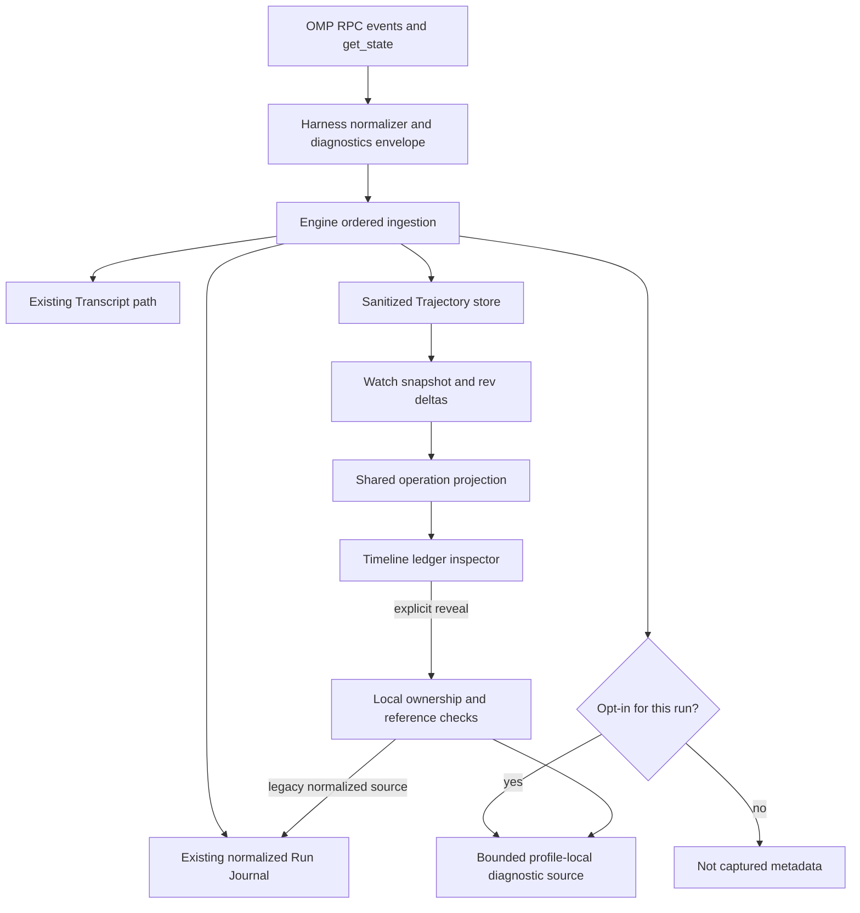
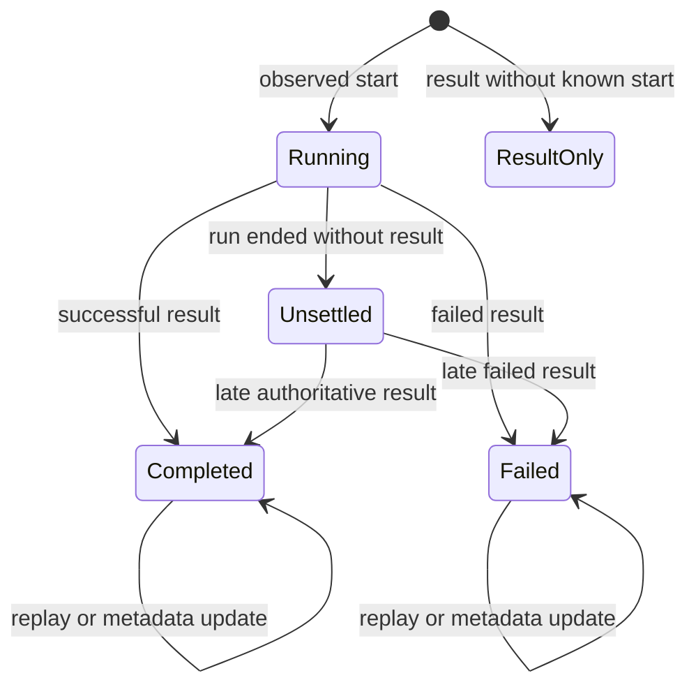
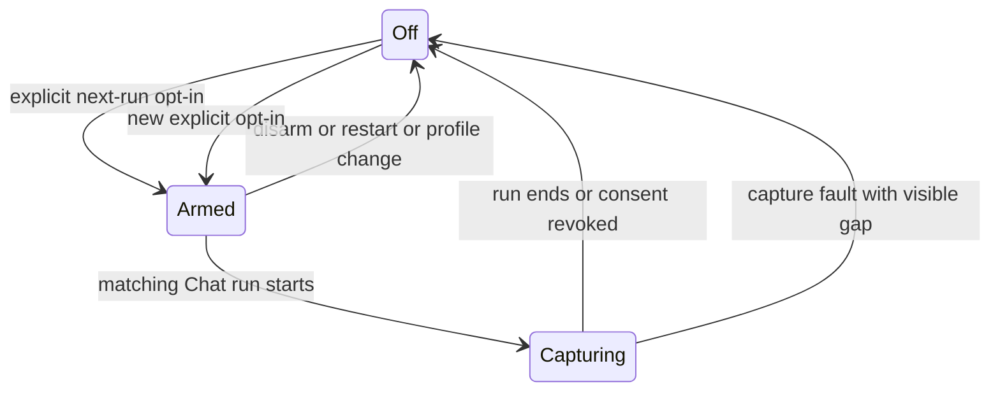
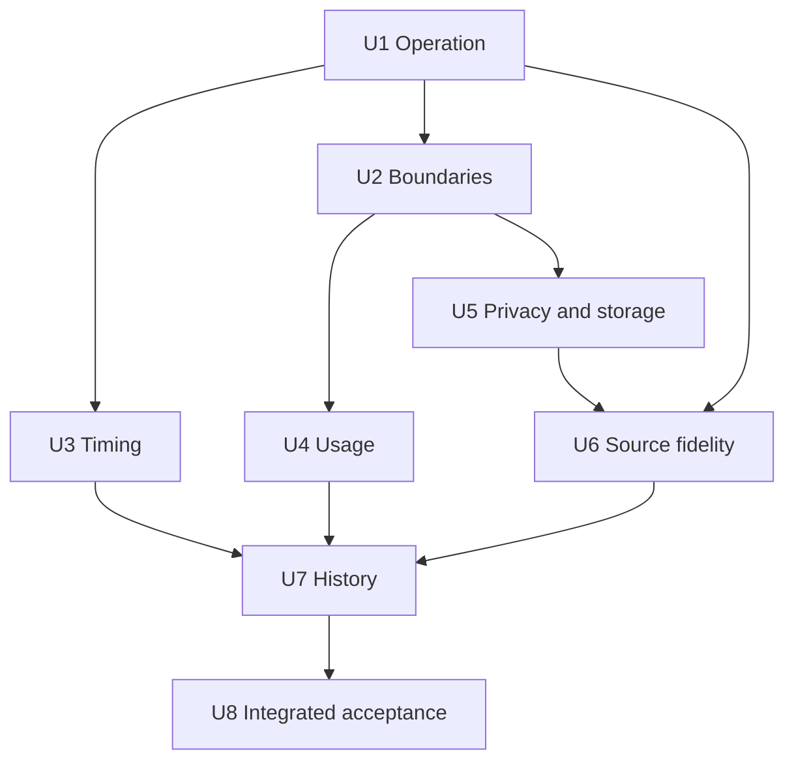

# fix: Trajectory observability fidelity

## Summary

Corrigir a fidelidade da Trajectory de ponta a ponta: operação correlacionada, hierarquia real, tempos utilizáveis, métricas honestas, schema observado e captura completa opt-in. Recuperar do histórico somente fatos ainda disponíveis. O plano não autoriza implementação, commit, reinício do app ou publicação.

## Problem Frame

A auditoria do run `f63918ca-c444-4bf5-b63c-98b2953070f1`, Chat `b42f5545-dd7a-46ee-b16a-ca94f37d8ba0`, encontrou a chamada `:174` ainda Running, embora o resultado `:177` tenha o mesmo call ID, Completed e 69 bytes no Run Journal. As 34 chamadas únicas têm resultado; os 38 registros de chamada, incluindo quatro atualizações com IDs repetidos, continuam Running.

- F1. O inspector lê um registro isolado e não resolve a operação chamada→resultado.
- F2. Os 86 registros desse run não têm turn/step; o agrupamento usa fallback e Fold Calls dobra o step inteiro.
- F3. A geometria Recorded exige startedAt em todos os registros; 44/86 não o têm, apesar de conterem outros tempos observados.
- F4. O journal registra 109.686 tokens de contexto e janela 272.000; a Trajectory descarta a ocupação e apresenta zeros sintéticos de consumo.

Duas limitações adicionais entram no escopo solicitado: Schema contém descrições estáticas, e Raw Payload usa dados já normalizados em vez dos argumentos originais completos. Não houve prova de falha no RPC Reveal; sua acessibilidade e fidelidade devem ser exercitadas, não tratadas como causa demonstrada.

A política aprovada é captura completa opt-in, registrada em `docs/adr/0005-complete-trajectory-capture-is-opt-in.md`. O contrato anterior de captura sanitizada sempre ativa permanece.

---

## Scope Boundaries

**Inclui:** Trajectory de Chats locais OMP; correlação compartilhada que também deve aceitar os eventos atuais de outros harnesses; histórico/live/reabertura; captura diagnóstica protegida; metadados de schema; casos de falha, indisponibilidade e truncamento; validação GPUI real.

**Preserva:** três lanes, pane existente, uma surface por Chat, sanitização, isolamento por perfil/device, capture fail-open, writer serializado, watermark com rev, separação de recovery e Transcript, archive sem apagar histórico semântico.

**Exclui:** trajetórias de CLI Workers, sync/export de dados crus, armazenamento do ambiente herdado inteiro, captura de arquivos de credenciais, troca de provider, instrumentação de requests HTTP do modelo, alteração de quotas Managed Provider Usage, redesign geral e execução do plano concorrente de paridade OMP.

Captura completa refere-se aos argumentos e ao resultado que o runtime entrega no evento de execução da ferramenta. Não significa requisição bruta do provider, saída ilimitada, promessa de recuperar artefatos externos expirados ou reconstrução de dados que o runtime nunca enviou.

---

## Requirements

### Operation and hierarchy

- R1. Selecionar chamada ou resultado abre a mesma operação, com identidade do evento selecionado preservada, entrada, saída, estado final e navegação entre seus eventos. Cobre F1.
- R2. Replay, resultados fora da ordem de chamadas concorrentes, atualização de tool com mesmo ID e filhos homônimos não duplicam nem cruzam operações. A correlação funciona mesmo quando chamada e resultado estão em páginas diferentes do histórico.
- R3. Operação sem resultado não recebe sucesso por causa de Done do run; a UI distingue em execução, concluída, falha e encerrada sem resultado conhecido.
- R4. Turns/Steps refletem fronteiras observadas; Fold Calls oculta apenas ferramentas, mantendo texto/reasoning e seleção. Fronteiras desconhecidas ficam identificadas como desconhecidas. Cobre F2.

### Timing and usage

- R5. Recorded representa instantes e intervalos observados, sem um evento incompleto derrubar todo o histórico para Sequence. Duração de execução, intervalo observado pelo host e ausência de tempo são distintos. Cobre F3.
- R6. Ocupação de contexto, consumo input/output e cache são métricas separadas, com origem e disponibilidade. Ausência não vira zero; replay e resume não duplicam uso. Cobre F4.

### Source fidelity and privacy

- R7. Schema mostra o contrato observado do runtime, com origem e momento/versão do snapshot. Descrição de tipo normalizado não é apresentada como JSON Schema efetivo.
- R8. Com opt-in, argumentos completos e resultado original recebido são preservados em fonte diagnóstica local protegida; preview continua sanitizado e Reveal explícito.
- R9. Opt-in é específico para o próximo run de um Chat no perfil atual. Não é ativado por abrir Trajectory, não é herdado por outro Chat e não rearma depois de restart.
- R10. Dados completos nunca entram no broadcast genérico AgentEvent, Run Journal de recovery, SessionDoc/Loro, watch sanitizado, logs, Live Voice ou export. Apenas fonte diagnóstica isolada e resposta local de Reveal podem contê-los.
- R11. Fonte ausente, limitada, expirada, corrompida ou de outro escopo é indicada sem sucesso vazio; resposta tardia de Reveal não restaura conteúdo após troca de seleção, perfil ou deleção.

### History and acceptance

- R12. Histórico existente recebe correlação e recupera métricas ainda presentes, sem reescrever Run Journal nem substituir eventos históricos pelo estado atual do OMP.
- R13. O mesmo cenário converge em captura ao vivo, snapshot após fechamento da surface, reconexão por rev e reabertura do store, preservando seleção e scroll.
- R14. Falha/saturação de captura diagnóstica não bloqueia o run e deixa a incompletude observável. Retenção de dados completos não apaga eventos semânticos.

### Original-contract traceability

Os IDs R1–R14 deste plano são locais. O prefixo `origin:` abaixo desambigua o documento de origem.

| Contrato original | Tratamento neste plano |
|---|---|
| origin:R1–R6 / AE1 | Entry point, surface única e lifecycle preservados; regressão U8 |
| origin:R7–R13 / AE2–AE4 | Captura sempre ativa e histórico honesto; R5, R9, R12–R14; U2/U5/U7/U8 |
| origin:R14–R24 / AE5–AE6 | Lanes/ordem/folds/seleção/scroll; R1–R5, R13; U1/U2/U3/U8 |
| origin:R25–R31 / AE7–AE8 | Inspector e privacidade; R1, R6–R11; U1/U4/U5/U6/U8 |
| origin:A1–A3 / F1–F5 | Usuário inspeciona; device executor captura/revela; runtime fornece fatos; fronteiras mantidas |

---

## Key Technical Decisions

- KTD1. **Eventos imutáveis, operação derivada.** Manter IDs e ordem do ledger; derivar uma operação usando perfil/Chat/run/escopo pai completo/call ID. Chamada e resultado continuam eventos distintos, mas o inspector consulta a operação. Não atualizar arbitrariamente a row de início para mascarar ausência de ligação.
- KTD2. **Uma projeção compartilhada, independente da paginação.** Correlação e precedência vivem em `crates/proto/src/trajectory.rs`; engine e UI consomem essa mesma lógica. A seleção com fonte fora da janela carregada usa uma consulta local indexada por scoped call ID, com snapshot/rev e completude explícitos. “Não carregado” não é “sem resultado”. Indexar referências a registros, sem copiar payloads por render, carregar todo o histórico ou fazer join quadrático a cada delta.
- KTD3. **Atualização não é nova execução.** Repetições autoritativas de uma tool, como o snapshot de todo, atualizam sua operação sem reiniciar tempo nem apagar resultado. Colisão ambígua de call ID no mesmo escopo recebe diagnóstico; não é silenciosamente fundida.
- KTD4. **Metadados de diagnóstico têm uma fronteira própria.** Estender a saída interna harness→engine com envelope que transporte evento normalizado e metadados correlacionáveis. A engine extrai os metadados antes do fan-out existente; bytes completos são opt-in e não pertencem a AgentEvent serializável/broadcast. O journal atribui a sequência do evento normalizado; a fonte diagnóstica se liga a essa identidade, sem alterar recovery.
- KTD5. **Turn do OMP não é automaticamente Turn do Chat.** A fonte OMP define turn como uma resposta do assistente com suas tools. Mapear essa fronteira a Step; Turn da Trajectory abre por entrada de usuário consumida e inclui seus steps até a próxima entrada. IDs locais derivam de fronteiras observadas, não de textos, relógio ou UUID gerado no render. Steering apenas no consumo, nunca no ACK. Legado sem fronteira comprovada permanece desconhecido.
- KTD6. **Tempo tem proveniência.** Capturar timestamp wall-clock e intervalo monotônico quando possível; execução reportada pelo runtime prevalece como métrica separada. End-only é instante, não falta total de tempo. Fonte legada sequence-only fica em segmento identificado; não recebe eixo temporal inventado nem força runs medidos a perder seu eixo.
- KTD7. **Consumo vem de mensagem final autoritativa.** Usar usage de assistant message_end quando disponível; deduplicar por run/escopo/identidade de mensagem. get_state.contextUsage fornece ocupação, nunca consumo. Totais cumulativos de sessão não são somados como se fossem deltas de run. Não somar cache duas vezes; campos ausentes permanecem ausentes.
- KTD8. **Schema é snapshot, não inferência.** A fonte local de OMP tem get_state.dumpTools com parameters=toolWireSchema(tool). Reutilizar essa resposta após registro das host tools e em fronteiras onde o catálogo possa mudar; extrair somente os campos necessários, nunca copiar systemPrompt. Vincular snapshot observado ao run/step; não afirmar que um snapshot antigo era o schema exato de uma chamada se o runtime não permite comprovar isso.
- KTD9. **Fonte completa separada e finita.** Usar armazenamento diagnóstico profile-local separado do SQLite sanitizado e do journal. Diretório owner-only e arquivos owner-only, writer bounded, leitura só via referência opaca autorizada. Não escolher formato próprio de criptografia nem prometer proteção contra processos do mesmo usuário, root ou backups externos.
- KTD10. **Opt-in não enfraquece Reveal.** Armado para o próximo run, consentimento consumido no início, captura independe da surface. Revogação para o run ativo impede novas escritas completas; bytes já capturados só somem por apagar diagnóstico ou retenção. Preferência armada é efêmera e limpa em restart/perfil/deleção.
- KTD11. **Defaults de retenção propostos.** Fonte completa expira em 7 dias, tem orçamento global por perfil de 128 MiB e campo de até 1 MiB, incluindo metadados de tamanho original/truncamento. Excesso causa indisponibilidade explícita, não escrita ilimitada. Arquivo em leitura não fixa writer/WAL nem escapa à autorização após deleção. A política não poda histórico semântico nem journals preexistentes.
- KTD12. **Reparo histórico versionado, sem reset.** Correlação é aplicada sobre registros existentes. Recuperação de contexto antigo usa importador bounded e versão de enriquecimento independente do marker legacy one-shot; gravar patch por identidade e rev, idempotentemente. Nunca apagar a base para reimportar nem reescrever todos os dados durante boot.

---

## High-Level Technical Design

### Data path and privacy boundary



A engine faz o fan-out somente após separar bytes diagnósticos. O watch transporta preview e referência, nunca corpo completo. O inspector resolve um evento dentro de sua operação, mantendo o sourceSeq selecionado.

### Selection and live convergence

```mermaid
sequenceDiagram
    participant H as Harness
    participant E as Engine store
    participant V as Trajectory view
    H->>E: ToolCall plus source identity
    E->>V: Committed start event
    V->>V: Select start and derive Running operation
    H->>E: ToolResult for same scoped call
    E->>V: Committed result event with rev
    V->>V: Keep selection; derive final status and Result
    V->>E: Explicit Reveal using result reference
    E->>V: Authorized source with fidelity metadata
```

Resultado recebido depois da seleção atualiza o inspector sem reseleção. Trocar a seleção cancela/invalida o Reveal em voo; receber o resultado depois não altera essa regra.

### Operation state



ResultOnly tem desfecho do resultado, entrada desconhecida e nenhuma duração inferida. Done do run não converte operações sem resultado em Completed. Unknown/Unsettled não são equivalentes a erro de ferramenta.

### Complete-capture lifecycle



O término da captura não apaga automaticamente a fonte já gravada: ela segue TTL/orçamento e a ação local de apagar diagnóstico. Abrir/fechar Trajectory não participa dessa máquina de estados.

---

## Implementation Units

Os sinais red-capable abaixo são contratos de testes a introduzir na implementação, não comandos já executados ou testes que já existam. Cada bug fecha com o mesmo teste focal que demonstrou o comportamento incorreto. Fixtures devem nascer do formato realmente emitido, sem dados sensíveis do usuário.

### U1. Correlated operation and inspector

**Goal:** Eliminar Running/Result incorretos ao selecionar uma chamada encerrada.

**Requirements:** R1–R3, R13; F1. **Dependencies:** nenhuma.

**Files:** `crates/proto/src/trajectory.rs`; `crates/rpc/src/{lib.rs,method.rs}`; `crates/engine/src/{trajectory_store.rs,rpc.rs}`; `crates/ui/src/trajectory/{model.rs,inspector.rs,view.rs,ledger.rs}`; testes co-located nesses arquivos.

**Execution note:** Characterization-first. Sinal planejado: `cargo test -p zeron-ui trajectory_operation_contract`. Alimentar o modelo com eventos separados equivalentes a :174/:177, selecionar :174 e exigir estado final e referência do resultado :177.

**Approach:** Adicionar projeção de operação e lookup do evento selecionado; manter evento/Record ID separado do resumo operacional. Result/Payload podem vir dos eventos irmãos da mesma operação. Propagar updates por rev sem substituir seleção. Retirar uso indiscriminado de Running para marcar campos que nunca serão produzidos como Unsettled. Result ausente deve explicar motivo; labels de conclusão incluem nome da tool. Busca aceita call ID para navegação técnica.

Consulta proposta `GetTrajectoryOperation`: aceita Chat e Record ID selecionado, não um path ou identidade arbitrária de fonte. A engine valida ownership, resolve o scoped call ID e lê seus eventos por índice numa revisão consistente. Retorna projeção sanitizada, referências dos eventos e completude; página excedente usa cursor bounded. Watch por rev invalida essa projeção quando a operação muda. Falta de página apresenta carregamento/incompletude até resolver, nunca Unsettled conclusivo.

**Patterns to follow:** `stream_order_key`, `apply_deltas`, `TrajectoryRecord::effective_status`, guard de expected_params em `TrajectoryView::start_reveal`.

**Test scenarios:**
1. Covers F1. Start→success/error→Done, seleção no início: desfecho e Result corretos, Record ID original preservado.
2. Duas tools concorrentes retornam na ordem inversa: nenhum resultado cruzado.
3. Mesmo call ID em outro run/Chat/escopo filho não se mistura; ambiguidades no mesmo escopo não escolhem um resultado arbitrário.
4. Snapshot de todo com mesmo ID depois da conclusão não reabre operação; replay não duplica uso nem resultado.
5. Done sem resultado mantém ausência explícita; resultado tardio legítimo resolve a operação; ResultOnly permanece inspecionável.
6. Reveal iniciado e nova seleção/profile/delete antes da resposta: nenhum texto antigo aparece.
7. Milhares de eventos entre início e resultado, carregados em páginas distintas: selecionar a chamada resolve resultado sem carregar todo o Chat; update que chega durante a consulta não é perdido nem sobrescrito por snapshot antigo.

**Verification:** Mesmo sinal red-capable passa; chamada real selecionada antes do fim recebe resultado sem clicar novamente, e também funciona depois de reload.

**must_haves:** truths: início e resultado mostram a mesma operação mesmo fora da página; desfecho não é fabricado; seleção estável. artifacts: projeção em proto, consulta indexada local, consumidor UI e regressões. key_links: seleção→`GetTrajectoryOperation`→projeção compartilhada→inspector; `reveal_params`→referência do evento fonte correto.

### U2. Observed boundaries and independent folds

**Goal:** Alimentar Turns/Steps e fazer Fold Calls atuar apenas sobre tools.

**Requirements:** R2–R4, R13; F2. **Dependencies:** U1.

**Files:** `crates/harness/src/{lib.rs,omp/mod.rs,omp/normalize.rs}`; `crates/proto/src/trajectory.rs`; `crates/engine/src/{sessions.rs,trajectory_store.rs}`; `crates/ui/src/trajectory/{model.rs,ledger.rs}`; testes `crates/harness/tests/omp_rpc.rs`, fixtures em `crates/harness/tests/fixtures/` e testes co-located.

**Execution note:** Characterization-first. Sinal planejado: `cargo test -p zeron-ui trajectory_hierarchy_contract`; fixture contém user consumido, duas respostas com tools e segunda entrada de usuário, passando pelo normalizador/captura antes da projeção.

**Approach:** Introduzir o envelope interno KTD4 sem alterar o formato de recovery nem publicar bytes crus. Processar fronteiras observadas no runtime e aplicá-las à captura seguinte na mesma ordem. Migrar os consumidores do stream interno pelo compilador/references, mantendo outros harnesses com metadados ausentes. Separar Fold Calls de Step; grupos de tools não engolem reasoning nem mudam a ordem de eventos intercalados. Seleção de span oculto deve revelar seu ancestral necessário sem mudar a política global de dobra.

**Patterns to follow:** fronteira de steering consumido no harness; `group_records`; `fold_overrides`; IDs estáveis baseados em source sequence.

**Test scenarios:**
1. Covers F2. Duas respostas do modelo na mesma entrada formam Steps distintos dentro do mesmo Turn; nova entrada consumida inicia novo Turn.
2. ACK de steering não abre fronteira; consumo abre exatamente uma, sem duplicar UserMessage no Transcript.
3. Fold Calls oculta ferramentas e mantém textos/reasoning; Fold Turns é independente; overrides manuais continuam soberanos.
4. Subagentes intercalados preservam escopo e ordem global; chamada em um escopo não herda step do outro.
5. Runtime sem fronteiras e legado não recebem Step 1 fictício apresentado como fato.
6. Reconexão/replay de fronteiras não renumera grupos nem desloca seleção.

**Verification:** O mesmo sinal passa; timeline, ledger e inspector concordam sobre grupos observados e desconhecidos.

**must_haves:** truths: hierarquia corresponde ao consumo real; dobrar tools preserva conteúdo do modelo. artifacts: normalização/envelope e metadados de fronteira, projeção/fold testados. key_links: `OmpNormalizer::push` → ingestão de diagnóstico em sessions → `group_records` → ledger.

### U3. Recorded instants and operation intervals

**Goal:** Usar os tempos disponíveis sem invalidar toda a timeline.

**Requirements:** R5, R13; F3. **Dependencies:** U1.

**Files:** `crates/proto/src/trajectory.rs`; `crates/engine/src/{sessions.rs,trajectory_store.rs}`; `crates/ui/src/trajectory/{timeline.rs,inspector.rs,toolbar.rs}`; testes co-located.

**Execution note:** Characterization-first. Sinal planejado: `cargo test -p zeron-ui trajectory_recorded_contract`; usar start-only, end-only e mensagem final como a captura atual, não intervalos perfeitos construídos só para o teste.

**Approach:** Evento pontual usa timestamp observado como posição; operação com início/fim usa intervalo correlacionado. Preferir relógio monotônico para elapsed novo; persistir proveniência. Layout por run/segmento diferencia sequência legada de Recorded, com escala e fallback visíveis. Não preencher duração ausente com zero nem usar duração de tool como tokens/tempo de modelo.

**Patterns to follow:** `TrajectoryTiming`, `effective_duration_ms`, `span_end`, proteção de overflow e hit-testing de `LaneSpan`.

**Test scenarios:**
1. Covers F3. ToolResult end-only não derruba eventos medidos para larguras iguais; um run com apenas instantes ainda tem posições válidas.
2. Run legado ao lado de run medido mantém segmento sequence-only identificado sem contaminar o novo.
3. Duração reportada e intervalo host diferem: UI nomeia ambas corretamente, sem vender latência de transporte como execução.
4. Relógio recua, duração estoura ou resultado precede início: sem panic nem duração negativa inventada; diagnóstico localizado.
5. Trocar modo conserva seleção, range, erro e alvo de clique; intervals concorrentes continuam selecionáveis.

**Verification:** Mesmo sinal passa; smoke nativo mostra diferenças temporais reais e identifica trechos sem medição.

**must_haves:** truths: tempo disponível é utilizável; tempo ausente é explícito; clique permanece fiel ao evento. artifacts: timing/provenance e layout/inspector atualizados. key_links: captura→`TrajectoryTiming`→`lane_layout`→inspector/toolbar.

### U4. Honest model usage and context occupancy

**Goal:** Preservar contexto e consumo real sem zeros sintéticos nem dupla contagem.

**Requirements:** R6, R12–R13; F4. **Dependencies:** U2.

**Files:** `crates/harness/src/omp/{mod.rs,normalize.rs,protocol.rs}`; `crates/proto/src/trajectory.rs`; `crates/engine/src/{sessions.rs,trajectory_store.rs}`; `crates/ui/src/trajectory/inspector.rs`; testes `crates/harness/tests/omp_rpc.rs` e co-located.

**Execution note:** Characterization-first. Sinal planejado: `cargo test -p zeron-engine trajectory_usage_fidelity`; contexto=109686/janela=272000 sem consumo medido deve continuar contexto conhecido e consumo indisponível após store/reopen.

**Approach:** Extrair usage de mensagem final autoritativa pelo envelope diagnóstico; manter o comportamento atual do indicador de contexto do Chat. Fazer absence/zero medido distinguíveis no contrato de Trajectory. Capturar input/output/cache/total somente quando oferecidos, com definição de total coerente com o runtime. A tool não herda tokens do run; métricas de modelo aparecem em mensagem/step/run aplicáveis. Totais incompletos declaram parcialidade.

**Patterns to follow:** `ContextUsage` e retenção last-known da engine; serialização opcional; separação de Managed Provider Usage descrita no CONTEXT.

**Test scenarios:**
1. Covers F4. Journal com ocupação real e zeros de adapter antigo: consumo não é apresentado como medição zero; ocupação é preservada.
2. Mensagem final com zero efetivamente reportado continua zero conhecido, distinguível de ausência.
3. message_end e turn_end transportam a mesma mensagem: consumo contado uma vez; replay/resume não soma histórico novamente.
4. Cache ausente versus cache presente; total sem dupla soma; subagente não é somado duas vezes ao pai.
5. Contexto muda após compactação/modelo: snapshot histórico conserva o valor e janela observados, sem propagação retroativa.

**Verification:** Mesmo sinal passa, consumo apresentado corresponde aos frames finais reais e o indicador atual do Chat não regride.

**must_haves:** truths: contexto conhecido não some; ausência não vira zero; replay não infla consumo. artifacts: normalização, persistência e inspector testados. key_links: `message_end`/`get_state.contextUsage`→envelope→usage persistido→summary.

### U5. Opt-in diagnostic storage and authorized reveal

**Goal:** Criar a fronteira segura que permite reter fontes completas sem contaminar o caminho público.

**Requirements:** R8–R11, R14. **Dependencies:** U2.

**Files:** `crates/proto/src/trajectory.rs`; `crates/rpc/src/{lib.rs,method.rs}`; `crates/engine/src/{profile.rs,lib.rs,sessions.rs,rpc.rs,trajectory_store.rs,workspace_host.rs}`; novo `crates/engine/src/trajectory_diagnostics.rs` como dono isolado da fonte completa; `crates/ui/src/trajectory/{toolbar.rs,view.rs,model.rs,inspector.rs}`; testes co-located e `crates/rpc/tests/device_room.rs`.

**Approach:** Implementar armar/desarmar próximo run e revogar captura ativa como controle engine-owned, profile/Chat-scoped, local-only. Fonte completa com limites KTD11 e referências opacas; nenhuma montagem de path pelo cliente. Limites e captura ativa ficam visíveis antes do opt-in. Writer não bloqueante; falha fecha captura completa e registra indisponibilidade sem parar run. Usar autorização existente de Reveal, com verificação da referência anexada a registro persistido, versão, call/parent/field e fonte. Preservar reveal legado identificado como normalizado. Expiração e deleção invalidam referências; não prometer secure erase de SSD/backups.

**Patterns to follow:** writer e degradação de `TrajectoryStore`; `EngineProfile::store_root`; barreira local-only em relay; `reveal_semaphore`; invalidação por seleção no view.

**Test scenarios:**
1. Opt-in desligado: sentinel sensível em args nunca chega à fonte diagnóstica, SQLite sanitizado, watch, logs, Voice ou Transcript/export; o journal normalizado legado pode conter o que já continha, sem ampliação por esta feature.
2. Armado para A/perfil X: run B não consome consentimento; run A consome uma vez; fechar surface não desliga captura; restart não rearma.
3. Após autorização local, Reveal mostra um único campo correto; fonte de outro Chat/perfil/device ou referência forjada falha sem vazar dados.
4. Revogar no meio do run impede novas escritas completas; apagar diagnóstico limpa fonte e UI sem apagar ledger/recovery.
5. Tamanho acima do limite, orçamento saturado, TTL, writer morto, disco sem escrita e fonte corrupta produzem motivos explícitos; run continua.
6. Deleção local, sync e Space cascade removem fonte; archive mantém semântico e respeita TTL do diagnóstico.
7. RPC remoto é rejeitado mesmo sem targetDeviceId; resposta tardia não reexibe conteúdo apagado.

**Verification:** Invariantes de privacidade testadas entre camadas, opt-in exercitado na UI e falha induzida sem interromper a execução da ferramenta. Não habilitar captura completa de produção enquanto esta unidade não estiver integrada.

**must_haves:** truths: consentimento é específico e finito; source completa só aparece após Reveal autorizado; falha de diagnóstico não interrompe trabalho. artifacts: storage proprietário, controles locais e testes de isolamento. key_links: toolbar→RPC local→política engine→writer diagnóstico; Reveal→autorização→source.

### U6. Runtime schema and original tool data

**Goal:** Fazer Schema/Payload/Result declarar e entregar a fonte realmente disponível.

**Requirements:** R7–R11. **Dependencies:** U1, U2, U5.

**Files:** `crates/harness/src/omp/{mod.rs,normalize.rs,protocol.rs,process.rs}`; `crates/proto/src/trajectory.rs`; `crates/engine/src/{sessions.rs,trajectory_store.rs,trajectory_diagnostics.rs,rpc.rs}`; `crates/ui/src/trajectory/{inspector.rs,view.rs}`; testes `crates/harness/tests/omp_rpc.rs`, fixtures no diretório existente e co-located.

**Approach:** Consumir get_state.dumpTools, deduplicar snapshots por conteúdo/identidade e preservar origem/runtime/tempo observado. Não gerar schema a partir de parâmetros de uma chamada. Capturar args de tool_execution_start e objeto result de tool_execution_end antes da normalização, somente com política opt-in ativa. Manter distinção entre original recebido, preview sanitizado, normalizado legado, truncado e não capturado. Erros específicos e metadados de disponibilidade chegam à UI; não reduzir todos a “StoreUnavailable”. Schemas com descrições/examples potencialmente sensíveis também atravessam sanitização; variante completa só pela política de diagnóstico.

**Patterns to follow:** chunk assembly negociado em `OmpProcess`; resultado normalizado atual permanece para Transcript; `TrajectoryRawRef` versionado e campo específico.

**Test scenarios:**
1. Schema do runtime contém required/properties/enum: inspector mostra esse contrato e proveniência, não “command: string”.
2. Catálogo muda depois do snapshot: histórico mantém o snapshot anterior e declara a precisão temporal; ausência de snapshot vinculado não usa catálogo atual como se fosse histórico.
3. Args de bash incluem command/cwd/env/timeout: opt-in on preserva os campos recebidos; off não os persiste como fonte completa.
4. ToolResult com texto e details/diff/imagem/referência: original recebido é inspecionável sem apagar partes por precedência diff-versus-output; binário grande tem tipo/tamanho/referência e limite explícitos.
5. Runtime sem dumpTools, fonte truncada ou resultado já resumido pelo OMP: UI informa limite; não anuncia paridade completa nem busca arquivos externos automaticamente.
6. Troca seleção durante Reveal, erro de transporte e fonte expirada: nenhuma resposta cruzada; retry explícito possível quando seguro.

**Verification:** Dois snapshots distintos do catálogo e uma chamada real multimetadados comprovam fidelidade; limites aparecem em tela. Compatibilidade deve ser exercitada contra versão instalada antes de considerar esta unidade concluída.

**must_haves:** truths: schema tem fonte real; original não é normalizado disfarçado; dado indisponível não finge sucesso. artifacts: extração de schemas/args/result, source ligada ao registro e inspector. key_links: `get_state.dumpTools`→snapshot referenciado; `tool_execution_start/end`→envelope protegido→source→Reveal.

### U7. Historical enrichment without destructive reimport

**Goal:** Corrigir o histórico recuperável e declarar o que não pode ser recuperado.

**Requirements:** R12–R14. **Dependencies:** U1, U2, U3, U4, U6.

**Files:** `crates/engine/src/{trajectory_store.rs,run_journal.rs,rpc.rs}`; `crates/proto/src/trajectory.rs`; testes co-located, `crates/engine/tests/restart_resume.rs` e novo `crates/engine/tests/trajectory_fidelity.rs` para integração.

**Execution note:** Characterization-first. Sinal planejado: `cargo test -p zeron-engine --test trajectory_fidelity`; perfil temporário com dados separados do caso auditado, incluindo usage antigo e duas versões de metadados.

**Approach:** Projetar F1 sobre rows existentes sem alterá-las. Enriquecer contexto/identidades somente a partir de fatos verificáveis ainda no journal local. Marcar proveniência normalizada-legada e consumo desconhecido dos zeros sintéticos antigos, sem reinterpretar todos os zeros de todos os providers. Migration aditiva, readers tolerantes e enrichments versionados; reprocessar só fontes elegíveis em lotes bounded. Schema e args não armazenados são não capturados. Preserve watermarks/rev, legacy marker, gaps e terminal states.

**Patterns to follow:** import legacy por cutover; ordered writer e revisão monotônica; `RunJournal::raw_reveal` com guards e `trajectory_watch` snapshot/rev.

**Test scenarios:**
1. Covers F1/F4. Store antigo reaberto mostra :174 associado a :177; recupera ocupação 109686/272000 e mantém consumo desconhecido.
2. Rodar enriquecimento duas vezes e retomar após crash produz mesmo resultado sem duplicação ou perda de fonte.
3. Journal ausente/corrupto/oversized não impede histórico existente; UI declara a lacuna localizada.
4. Escrita nativa concorrente e enriquecimento não substituem informação mais nova; subscriber por rev recebe o update de posição antiga.
5. Troca de versão, campos desconhecidos, archive e deleção mantêm compatibilidade e limites de ownership.
6. Run Journal e comportamento de restart/resume permanecem inalterados; não há reset/reimport destrutivo.

**Verification:** Mesmo sinal passa, reabertura de uma cópia isolada do histórico auditado funciona e a fonte de recovery permanece intacta.

**must_haves:** truths: histórico recuperável melhora sem reset; ausência histórica continua explícita; live não perde atualizações durante reparo. artifacts: enriquecimento versionado e integração persistente. key_links: legacy source→patch por identidade→writer rev→watch→mesma projeção U1.

### U8. End-to-end acceptance and contract closure

**Goal:** Aceitar a entrega somente com dados reais atravessando toda a cadeia e UI nativa observada.

**Requirements:** R1–R14. **Dependencies:** U1–U7.

**Files:** `crates/engine/tests/trajectory_fidelity.rs`; `crates/harness/tests/omp_rpc.rs`; testes e fixtures de `crates/ui/src/trajectory/{model.rs,inspector.rs,timeline.rs,view.rs}`; fixtures visuais no sistema existente de `crates/ui/src/capture.rs`; `openspec/specs/chat-trajectory-preview/spec.md` via change; DOX dos domínios alterados; `ARCHITECTURE.md`, `DESIGN.md`, `FUNCTIONAL-BASELINE.html` e `fork_changelog.md` apenas nos contratos afetados.

**Approach:** Reutilizar uma fixture derivada da forma real do transporte desde normalização→captura→persistência→watch→projeção→inspector. Substituir fixtures que fabricam a forma que a captura não produz. Rodar gates do repo após integração; validar GPUI em perfil isolado e build identificado, sem reiniciar o Comet que hospeda trabalho ativo. Evidência deve identificar o binário, perfil e cenário, não só uma captura da demo estática.

**Test scenarios:**
1. Live: chamada selecionada antes do resultado resolve sem reseleção, com erro/sucesso, tools paralelas e subagente.
2. Histórico: preview fechado durante run, reabertura e reinício recuperam operação, tempo e uso; reconexão não duplica.
3. Interação: Fold Calls preserva reasoning, timeline seleciona row offscreen, scroll antigo não salta, narrow detail retorna ao ledger; cores de erro legíveis em tema claro/escuro.
4. Privacidade: opt-in off/on, Reveal, troca de registro/perfil, expiração e delete; transcript/export/watch nunca recebem diagnóstico bruto.
5. Falha: tool sem resultado, schema não suportado, fonte ausente/truncada, storage degradado; nenhuma medição ou conclusão inventada.

**Verification:** Registro de conformidade R1–R14 com evidência por cenário; nenhuma unidade aceita só porque teste unitário ou build passou. Se o runtime instalado não expuser a fonte necessária, a entrega correspondente permanece bloqueada com a capability exata faltante, não concluída por fallback.

**must_haves:** truths: usuário audita o caso da captura sem procurar manualmente a conclusão; histórico/live convergem; todos os limites de fonte são visíveis. artifacts: integração real, screenshots/evidências nativas e contratos atualizados. key_links: adapter→store→watch→projection→inspector, consentimento→source→Reveal.

---

## Sequencing and Ownership



U3 pode avançar após U1 enquanto U2 prepara o envelope; U4 e U5 ficam elegíveis após U2. Arquivos compartilhados de proto/sessions/inspector exigem ownership explícito e serialização de edições ou worktrees integrados por um único dono; sobreposição física não cria dependência lógica artificial.

A implementação de U5/U6 é sensível por retenção de dados e autorização. Exige worker e revisão de segurança antes de aceitação. Catálogo de provider/modelo deve ser resolvido no momento da execução, não fixado neste plano.

O plano `docs/plans/2026-09-06-0238-feat-omp-chat-runtime-parity-plan.md` também altera o loop OMP/normalizador e a política de steering/compactação. Não absorver esse trabalho nem exigir sua conclusão total: integrar a fronteira de consumo sem contradizer seu owner, preservando seus testes. O checkout tinha extensas mudanças preexistentes; futura execução deve definir baseline com o estado real e não lançar worktree limpo de HEAD supondo que contém o código auditado.

---

## Acceptance Examples

- AE1. Covers F1/R1–R3. Dado start :174 e success :177 com mesmo scoped call ID, selecionar :174 após Done mostra Completed, entrada e Result de :177, sem trocar seu Record ID.
- AE2. Covers F2/R4. Dado reasoning→tool→texto→tool dentro de um Step, Fold Calls oculta apenas tools; texto e reasoning permanecem na ordem original.
- AE3. Covers F3/R5. Dado um resultado end-only ao lado de um intervalo medido e de outro run legado, Recorded mantém o intervalo medido e o instante; legado é identificado em sequência.
- AE4. Covers F4/R6. Dado contexto 109686/272000 e nenhum consumo autoritativo, inspector mostra a ocupação real e consumo indisponível, não 0 tokens.
- AE5. Covers R8–R11. Com captura armada para o próximo run do Chat A, argumentos originais são retidos só nesse run; outro Chat e o run seguinte não herdam a permissão; Reveal continua necessário.
- AE6. Covers R7/R12. Um run antigo sem schema não recebe o catálogo atual como se fosse seu schema histórico; o novo run mostra snapshot com proveniência.
- AE7. Covers R13–R14. Falha na fonte diagnóstica durante tool não muda seu resultado nem bloqueia o Chat; a operação informa que a fonte completa está incompleta.

---

## Risks and Deferred Execution Checks

- **Runtime instalado diferente da fonte.** Há referência local com get_state.dumpTools e eventos turn/message, mas o plano concorrente registra divergência de versão entre fonte e binário. Antes de implementar U2/U4/U6, capturar frames da versão efetivamente usada. Se faltarem capabilities, nomear o gap e propor adaptação do OMP em trabalho explicitamente autorizado; não inventar endpoints nem entregar Schema estático como correção.
- **Fonte semanticamente lossy.** O resultado recebido do OMP pode já conter truncamento/referência a artefato. Preservar essa representação e a informação de limite; não prometer stdout original ilimitado nem abrir caminhos arbitrários de referências.
- **Migração e writes concorrentes.** Reparo bounded com versão própria e patches por rev; sem broad reset, sem tocar recovery. Incluir crash/reopen como critério de aceite, não apenas deserialize.
- **Dados sensíveis no disco.** Permissões owner-only não protegem contra o mesmo usuário/root/backups. TTL e limite são redução de exposição, não garantia de apagamento forense. Dados já existentes no journal não são objeto de expurgo deste plano.
- **Performance e carga permanente.** Nenhuma consulta get_state por token, join quadrático por render, cópia de schema por evento ou I/O síncrono novo em publish. Watch lento não segura transação; source grande não bloqueia UI. Limites propostos devem ser exibidos e pinados como contrato na change.
- **Semântica de boundaries.** Fonte OMP usa turn para uma rodada de modelo. Não renomear os Turns visíveis do produto de forma acidental; a relação consumida pelo usuário é KTD5.


---

## Documentation and Sources

- `openspec/specs/chat-trajectory-preview/spec.md`: contrato corrente; a correção deve virar nova change, sem editar artifacts arquivados.
- `docs/brainstorms/2026-09-01-comet-chat-trajectory-preview-requirements.md` e `docs/plans/2026-09-01-1211-feat-chat-trajectory-preview-plan.md`: intenção original e fronteiras preservadas.
- `docs/adr/0004-trajectory-uses-a-separate-local-read-model.md` e `docs/adr/0005-complete-trajectory-capture-is-opt-in.md`: isolamento e consentimento.
- `crates/engine/src/trajectory_store.rs::project_event_to_record`, `crates/engine/src/sessions.rs::capture_trajectory_event`: formato real de captura.
- `crates/ui/src/trajectory/inspector.rs::sample_record`: fixture antiga contém resultado/turn/step/usage que a captura real não produz juntos.
- `crates/ui/src/trajectory/timeline.rs::compute_recorded_layout`: requisito global de startedAt incompatível com end-only.
- `crates/harness/src/omp/mod.rs::finish_agent_end`: zeros sintéticos junto de contextUsage.
- Fonte local OMP, repo irmão `../oh-my-pi`: `packages/coding-agent/src/modes/rpc/rpc-mode.ts` (get_state.dumpTools), `packages/agent/src/types.ts` (turn/message/tool lifecycle), `packages/coding-agent/src/modes/rpc/rpc-types.ts` (comandos existentes). Referência de contrato, não prova de versão instalada.

O DOX pass deve atualizar somente os owners cujo contrato mudar. Inventário funcional só poderá dizer completo após R1–R14 comprovados; comandos de teste de funções puras não substituem a evidência nativa.
