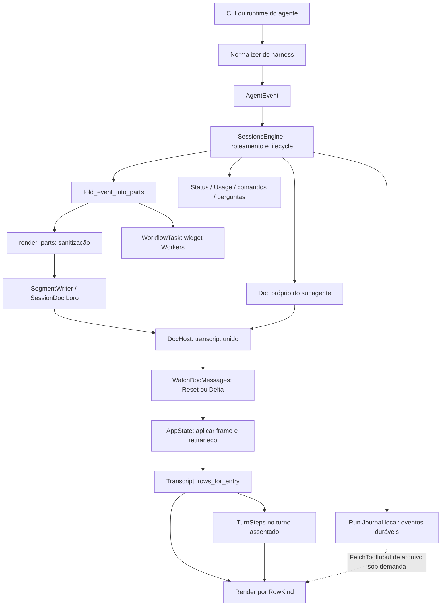

# Guia do streaming do Chat

Mapa do código observado em **09/09/2026**, no checkout `main`, HEAD `bd5ebf07eb029479a1f32696b5a54f80b7a7e8d9`, **incluindo alterações locais ainda não commitadas**. Este documento descreve o estado atual e os pontos de correção; não autoriza nem implementa uma refatoração.

O streaming não tem um renderer único. Há **17 tipos de evento**, **6 tipos de part persistida**, **12 famílias de tool**, **12 tipos de row**, **3 formatos de detalhe de tool** e **7 tipos de bloco Markdown**. As listas abaixo cobrem essas variantes do código. Nomes de MCP e tools `Unknown` são abertos: uma extensão pode trazer novos nomes sem criar um novo tipo de saída. A evidência e os hashes dos arquivos estão em [streaming-audit-2026-09-09.json](streaming-audit-2026-09-09.json).

## Como usar este guia

Catálogo para a próxima etapa: [Agent Elements — componentes e adoção gradual](agent-elements-adoption.md), com correspondência às rows e tools deste mapa. A adoção será nativa em gpui e incremental.

1. Identificar a saída pela tabela de rows (S01–S12) e a tool pela tabela T01–T12.
2. Localizar a camada responsável: normalização, persistência, projeção ou render.
3. Conferir os achados F01–F06 e os pontos ainda não provados Q01–Q04.
4. Definir a correção e seus exemplos de aceitação antes de editar. Uma mudança de capability seguirá OpenSpec; esta auditoria não muda capability.

Os links levam ao arquivo; os símbolos e números de linha identificam o trecho nesta fotografia. Depois de mudanças, o símbolo e o hash são mais confiáveis que uma linha antiga.

## Fluxo completo



| Camada | Responsabilidade e referência |
|---|---|
| Harness | Traduz o protocolo de cada runtime para `AgentEvent`; determina o que é texto, pensamento, chamada, resultado e fim. [`harness/src`](../crates/harness/src/) |
| Engine | Roteia subagentes; filtra ecos de tool de segmentos anteriores; separa segmentos no steer; publica eventos; coordena flush do documento. [`sessions.rs`](../crates/engine/src/sessions.rs): `drive_run`, filtro em 3097, fold em 3262, `sync_segment` em 2449 |
| Documento | `fold_event_into_parts` atualiza parts; `render_parts` sanitiza inputs antes de escrever; `SegmentWriter::sync` grava mudanças. [`parts.rs`](../crates/doc/src/parts.rs):576; [`sessions.rs`](../crates/engine/src/sessions.rs):2348; [`schema.rs`](../crates/doc/src/schema.rs):1223 |
| Transporte | DocHost observa commits locais/imports e publica transcript unido; `doc_messages_stream` emite reset inicial e deltas posteriores, pula deltas vazios. [`doc_host.rs`](../crates/engine/src/doc_host.rs); [`rpc.rs`](../crates/engine/src/rpc.rs):1007 |
| Mirror da UI | Aplica `Reset`, `upsert`, `append`, `remove`; verifica tamanho/âncoras; ressubscreve em desync; remove eco confirmado pelo mesmo ID. [`transcript_delta.rs`](../crates/doc/src/transcript_delta.rs):117/181; [`state.rs`](../crates/ui/src/state.rs):1001/2189 |
| Projeção | Cache por entry, parse incremental, part → rows, agrupamentos, identidade e versão. [`transcript.rs`](../crates/ui/src/transcript.rs):1395/4350/4630 |
| Render | `render_row_body` despacha para renderers diferentes; virtualização, altura, folds e caches pertencem ao `Transcript`. [`transcript.rs`](../crates/ui/src/transcript.rs):6001 |

**Fronteira importante:** o Chat Transcript é a fonte normal da UI. O Run Journal é local e mais rico. O fetch de input histórico de **Write/Edit** é um caminho explícito separado. A Trajectory é outra surface, com read model próprio; não deve ser usada como substituta silenciosa do transcript.

### Entradas por harness

| Harness | Entrada e normalização | Particularidade relevante |
|---|---|---|
| OMP | [`omp/normalize.rs`](../crates/harness/src/omp/normalize.rs):57,176,723 | `message_update.text_delta` → texto; `thinking_delta` → reasoning; `tool_execution_start/end` → chamada/resultado. `command_output` → **TextDelta**, portanto pode cair em Markdown, fora do painel de tool. `notice` de erro → Error. Subagent lifecycle/progress têm rotas próprias. |
| Claude Code | [`claude/normalize.rs`](../crates/harness/src/claude/normalize.rs):114,437 | Stream JSON; normalizador com estado para init, conteúdo progressivo e tráfego de subagentes; resultados de tools extraem texto. Frame completo e delta exigem tratamento próprio, não podem ser concatenados indiscriminadamente. |
| Codex | [`codex/mod.rs`](../crates/harness/src/codex/mod.rs), [`codex/normalize.rs`](../crates/harness/src/codex/normalize.rs):94,145 | App-server JSON-RPC; deltas de mensagem/reasoning separados de lifecycle de item. Há roteamento explícito de notificações de threads filhas. |
| Cursor | [`cursor/mod.rs`](../crates/harness/src/cursor/mod.rs):661,753 + `shim.mjs` | Frames `text`, `thinking`, `tool`, `usage`, `turn`, `fatal`; `task` vira spawn. |
| ACP (Grok, Hermes, Pi) | [`acp/normalize.rs`](../crates/harness/src/acp/normalize.rs):204,527 | `agent_message_chunk`, `agent_thought_chunk`, `tool_call/update`, `plan`. Eco `user_message_chunk` não vira nova mensagem. Updates só de resultado não devem reclassificar a tool. Plano usa ID singleton `acp-plan`. |
| OpenCode | [`opencode/mod.rs`](../crates/harness/src/opencode/mod.rs):1511,2028,2264 | HTTP/SSE; snapshots de part e deltas compartilham cursor `emitted`; snapshot já consumido não é append completo. Papel desconhecido aguarda resolução. |
| Mock | [`mock.rs`](../crates/harness/src/mock.rs) | Fonte sintética para demo/testes. Não comprova fidelidade de um provider real. |

Esta tabela documenta os adaptadores do checkout, não a versão atualmente instalada de cada CLI. Nenhum provider foi acionado nesta auditoria.

## Catálogo dos eventos: 17/17

Fonte: [`AgentEvent`](../crates/proto/src/agent.rs):451 e [`fold_event_into_parts`](../crates/doc/src/parts.rs):576.

| ID | Evento | Destino / efeito visível |
|---|---|---|
| E01 | `SessionStarted` | Identidade do run, modelo, cwd, status. Não cria row narrativa; reset do acumulador é protegido contra reemissão no meio do segmento. |
| E02 | `TextDelta` | Acrescenta à última part Text compatível; S02/S03, possivelmente S05 por extração de imagens. |
| E03 | `ReasoningDelta` | Acrescenta ao reasoning aberto; S04. Vazio é heartbeat e não cria row. |
| E04 | `AssistantMessageCompleted` | Fronteira interna de execução/steering; sem part visível própria. |
| E05 | `ToolCall` | Cria/atualiza Tool por ID; escolhe S06, S07 ou S09, conforme a família. |
| E06 | `ToolCallPreview` | Atualização transitória limitada, principalmente Write/Edit; mesmo ID. Alimenta preview vivo, não é journalada como chamada histórica completa. |
| E07 | `ToolResult` | Resolve a Tool existente por ID, atualiza erro, output, preview/stats, metadata. Não cria uma segunda row de resultado. Resultado sem chamada correspondente não cria Tool no fold. |
| E08 | `Usage` | Estado de contexto/usage; sem row no transcript. |
| E09 | `AvailableCommands` | Catálogo de comandos do composer; sem part persistida. |
| E10 | `WorkflowTask` | Part persistida atualizada por `task_id`; widget Workers. Ignorada na projeção de rows, inclusive para separar grupos. |
| E11 | `Error` | Acrescenta part Error → S11. Não há dedupe por mensagem neste fold. |
| E12 | `InputRequested` | Part Input por `request_id` → S10 e painel interativo no composer. |
| E13 | `InputResolved` | Atualiza a part Input existente. Não cria nova row. |
| E14 | `Steered` | Engine finaliza segmento anterior e prepara próximo; contexto de novo turno. Não vira linha “Steered”. |
| E15 | `Done` | Assenta o segmento, muda status, pode habilitar S08. `error` acrescenta Error; `result` não é append de texto no fold. Ver F01. |
| E16 | `UserMessage` | Quando atribuído a subagente, mensagem de usuário no doc filho; não é part da resposta do pai. |
| E17 | `Subagent` | Wrapper de atribuição: conteúdo no doc filho; pai conserva chip de spawn e lifecycle. |

As **6 parts** são `Text`, `Reasoning`, `Tool`, `Input`, `Error`, `WorkflowTask` ([`parts.rs`](../crates/doc/src/parts.rs):275). Rows não são eventos: uma part pode produzir várias rows; vários eventos podem atualizar uma única part.

## Catálogo das saídas da UI: 12/12

Fonte: [`RowKind`](../crates/ui/src/transcript.rs):734, projeção em 1403 e despacho em 6001.

| ID | Row | Conteúdo e apresentação atual | Expansão / destino |
|---|---|---|---|
| S01 | `User` | Prompt; menções; chips de URLs reconhecidas; anexos e badges. Eco fica com opacidade menor. Card até 100px. | Prompt excedente abre diálogo. Imagens abrem preview; documento é chip. Clone sticky é só paint, não outra mensagem. |
| S02 | `Markdown` | Um bloco de texto assentado. Mesma fonte base das rows compactas; títulos/listas/tabelas têm decoração própria. | Link/arquivo/copy; Mermaid assentado pode virar figura e lightbox. |
| S03 | `LiveMarkdown` | Um bloco em streaming, mesmos IDs de S02; append recebe fade de paint. | Fences incompletos passam pelo parse/mend; Mermaid permanece código enquanto streaming. |
| S04 | `Reasoning` | Header fixo `Thinking`/`Thought`; spinner de pontos do indicador de trabalho só enquanto ativo. | Corpo Markdown aberto por padrão, com linha vertical e recuo; escolha manual respeitada, seta sempre visível. |
| S05 | `InlineImages` | Galeria extraída de texto ou tools; até 6 caminhos por extração/grupo; imagem com altura fixa de 260px. | Preview de imagem. Dedupe local, não global do turno (F02). |
| S06 | `ToolGroup` | Uma ou mais tools comuns, ou sequência de spawns. Uma tool mostra só o header individual; várias comuns ganham resumo. | Grupo e detalhes fechados inicialmente. Spawn vinculado abre doc filho; não abre payload inline. |
| S07 | `FileChange` | **Write/Edit exclusivamente**: card próprio, filename, estado, stats e preview. Não usa header compacto genérico. | Preview fechado de 72px; aberto até 200px; fetch de input histórico e scroll próprios. Ver F03/F04. |
| S08 | `TurnSteps` | Resumo do prefixo de atividade de um turno assentado, antes do último Text. Não existe durante streaming. | Fechado inicialmente. Abrir monta as rows filhas com IDs preservados e folds internos independentes. |
| S09 | `TaskSnapshot` | Todo não vazio: título de criação/conclusão/atualização; detalhes com tarefas alteradas. | Fechado inicialmente; abre itens, sem output de tool. Snapshot idêntico ainda produz header (F06). |
| S10 | `Question` / `questions.rs` | `Asking question…`, pergunta + `Waiting for response…`, ou card `Answer/Answers` (header 28px, pergunta destacada, resposta discreta). | Passivo; controles no composer. Respostas persistem por id; sem linha genérica `ask`. |
| S11 | `ErrorChip` | `Error` + mensagem, tint vermelho; card com altura mínima de 34px, fonte 12px. | Sem detalhe expansível; quebras do erro são normalizadas para uma linha de texto na projeção. |
| S12 | `Notice` | Entry System: texto entre divisores, p.ex. troca de modelo. | Sem disclosure. Trocas de modelo consecutivas são reduzidas à última na UI. |

### Texto e código não são uma única superfície

Os **7 blocos Markdown** são `Paragraph`, `Heading`, `CodeBlock`, `BlockQuote`, `List`, `Table`, `Rule` ([`markdown/parser.rs`](../crates/ui/src/markdown/parser.rs):42). Inline suporta negrito, itálico, código, tachado e links; listas de tarefas são parseadas. Não existe um bloco genérico de HTML executável. Imagens locais são projetadas separadamente.

| Superfície | Renderer | Fonte / altura / controles |
|---|---|---|
| Prosa Markdown | `markdown/render.rs::render_block` | Base 14px/22px; regras próprias para headings, listas, tabelas. |
| Fence de código do assistente | `markdown/render.rs::render_code_block`:1054 | Mono 12,5px/18px, linguagem, syntax highlight e copy; scroll horizontal; altura cresce com as linhas. |
| Invocação + output de tool | `transcript.rs::detail_body`:8417 + painel em `render_tool_group` | Mono 11,5px/18px, borda/raio 8px, altura natural até 360px, quebra automática pela largura e apenas scroll vertical; 8px entre cards expandidos. `$` só na primeira linha da invocação Exec. **Output/JSON não recebe o highlight nem o copy do fence Markdown.** |
| Diff genérico legado/fetched | `ToolDetail::Diff` → `changes::render_file_body_with_syntax` | Hunks, contexto, números de linha e cores de adição/remoção; dentro do painel da tool. |
| Preview Write/Edit | `render_file_change` + `file_change.rs` | Mono 11,5px/20px, cores de linhas, scroll/virtualização e fetch próprios; não passa por `detail_body`. |

Portanto, “colocar em code block” precisa nomear **qual dessas superfícies**. Comando relatado em `TextDelta`, resultado em `ToolResult` e conteúdo Write/Edit têm caminhos diferentes.

## Catálogo das tools: 12/12

Fontes: [`ToolCall`](../crates/proto/src/agent.rs):169; [`tool_presentation`](../crates/proto/src/view.rs):638; [`stream_copy`](../crates/ui/src/transcript.rs):2154; [`tool_icon_descriptor`](../crates/ui/src/tool_icons.rs):266.

| ID | Família | Header vivo → resolvido | Ícone / detalhe / caminho |
|---|---|---|---|
| T01 | `Exec` | `Running command` → `Ran command` + resumo curto | Header em sans, detalhe apagado; expansão reúne header e invocação/resultado monoespaçados na mesma moldura S06. |
| T02 | `ReadFile` | `Reading` → `Read` + basename | Ícone de arquivo; caminho completo na invocação; resultado disponível via detalhe S06. |
| T03 | `WriteFile` | Filename + `Creating` → `Created` / `Failed` | S07 especializado, ícone `DOCUMENT_ADD`, preview/stats. Labels genéricos de `tool_presentation` não governam este header. |
| T04 | `EditFile` | Filename + `Editing` → `Edited` / `Failed` | Mesmo caminho especializado S07. |
| T05 | `ApplyPatch` | `Applying patch` → `Applied patch` + basename/workspace | S06 genérico, não S07; pode ter Diff/Stats. |
| T06 | `Search` | `Searching:` → `Searched:` + pattern/path | Ícone de busca; S06. |
| T07 | `Glob` | `Exploring files:` → `Explored files:` + pattern | Ícone de pasta; S06. |
| T08 | `WebFetch` | `Fetching:` → `Fetched:` + URL | Ícone Chrome; prompt é removido na sanitização normal; S06. |
| T09 | `WebSearch` | `Searching web:` → `Searched web:` + query | Ícone de busca; S06. |
| T10 | `Todo` | Não vazio: `Updating tasks`, `Created N tasks`, `Completed N tasks`, `N task updates`, `Updated tasks`, `Todo update failed` | S09. Vazio cai em S06 com `Updating todos`/`Updated todos`, sem itens. |
| T11 | `Mcp` | Apenas server/tool, sem prefixo de execução | `workers`/servidor `comet-workers`: action/alvo sem prefixo de execução; ícone semântico; spawn reconhecido recebe tratamento de agente. |
| T12 | `Unknown` | `Running tool` → `Ran tool` + nome | Especializações abaixo; fallback de ícone é settings. |

Especializações T12: `hub` usa `Running hub`/`Ran hub` + operação/alvo; `eval` mostra apenas título/detalhe, sem `Evaluating`/`Evaluated`; `Agent`/`Agent: descrição` usa chip de agente. Os prefixos textuais `js ·`/`javascript ·`/`py ·`/`python ·` são removidos em Unknown chamado exatamente `eval`, pois o ícone já identifica a linguagem. Sem título/código, permanece o fallback da tool. O ícone é Python para `py/python` e JavaScript nos demais casos.

O header genérico combina copy de `proto::view`, ajuste local em `stream_copy` e ícone de `tool_icons`: mexer em apenas um desses lugares pode deixar os outros divergentes. MCP chamado `eval` não passa automaticamente pela mesma regra de copy do Unknown `eval`.

### Invocação, resultado e precedência

`call_block` ([`transcript.rs`](../crates/ui/src/transcript.rs):604) constrói a **invocação disponível no transcript**, não garante input bruto completo. `Exec` conserva comando; Read/Edit conservam caminho; Write normalmente já perdeu `content`; MCP genérico sem input não gera invocação; Unknown pode mostrar apenas nome ou JSON de identificadores.

Os **3 formatos `ToolDetail`** são `Output`, `Diff`, `Stats`. `tool_detail`:554 escolhe **Diff > Stats não vazias > Output**. Um diff presente sem hunks retorna `None`, sem fallback para output. Após fetch, o último ref solicitado com sucesso decide qual detalhe aparece. Assim, erro textual junto de diff/stats não tem necessariamente um segundo caminho de exibição.

| Limite | Regra atual | Onde |
|---|---|---|
| Output no documento | Até 160 caracteres conserva texto pequeno; acima disso, primeira linha não vazia até 160 + `…`; linhas de fence removidas | `parts.rs::summarize_tool_output`:36 |
| Input no documento | Write sem conteúdo, Edit sem strings, WebFetch sem prompt; MCP/Unknown só whitelist de identificadores conhecida | `parts.rs::sanitize_tool_call`:890 |
| Eval no documento | Só `language` e `title`; código não fica neste JSON | `parts.rs`:919 |
| Hub no documento | `op`, `name`, `to`, `from`, `application`; IDs limitados a 8 | `parts.rs`:918/930 |
| Workers no documento | `action`, `session_id`, `project_id`, `name`, `project` | `parts.rs`:920 |
| Invocação/output inline | 24 linhas + linha explícita de quantas ficaram de fora; não quebra longas artificialmente | `call_block` / `tool_detail` |
| Full output por sidecar legado | Até 400 linhas no renderer; diff até 600 linhas | `blob_detail`:2373; `DIFF_DETAIL_MAX_LINES`:534 |
| Painel de tool | `min(altura invocação + resultado, 360) + 14px` de margens/borda; affordance de fetch acrescenta 24px | `tool_payload_height`:2344 |
| Preview de arquivo sincronizado | Até 15 linhas; até 512 caracteres por linha; marcador de corte | `parts.rs`:83/152 |
| Input histórico de arquivo | Fetch explícito ao host; preview limita snapshot a 1 MiB; mais de 64 linhas usa virtualização | `spawn_file_input_fetch`:4735; `file_change.rs`:7/167 |

**Sidecar de outputs novos está desativado no fluxo normal da engine** (`sessions.rs`:3263): não há upload/stamp automático de refs. A UI ainda sabe ler refs legados. Um output reduzido para `primeira linha…` sem ref não ganha “Show full output” só por estar dentro de uma caixa. O fetch de input de arquivo é separado dessa política. Não reativar sidecar nem revelar Run Journal como parte de uma correção visual.

## Agrupamento, identidade e rolagem

| Regra | Comportamento atual / referência |
|---|---|
| Tools consecutivas | Acumuladas em S06. Text, Reasoning, Input e Error encerram o grupo; WorkflowTask não o separa. Todo não vazio e Write/Edit saem do grupo para rows próprias. Troca entre spawn e tool comum separa grupos. `rows_for_entry_with_todo_history`:1494–1740 |
| Grupo de uma tool | Sem header agregador; tool individual conserva disclosure. `tool_group_collapses`:499 |
| Grupo de várias tools comuns | Um resumo; abrir revela headers individuais; abrir cada header revela payload. Isto é hierarquia, não duas execuções. `render_tool_group`:7481 |
| Turno assentado | `plan_turn_steps` exige tool anterior ao último Text não vazio. Input pendente ou subagente marcado Running impede fold. Prefixo vai para S08; último Text fica fora. Não exige status Complete especificamente: turno abortado também pode dobrar. `turn_steps.rs`:26 |
| Markdown | IDs `entry#part.block`; S03 → S02 preserva ID. Uma part Text inteira compartilha o status da entry; não existe campo explícito commentary/final nessa part. |
| Outros IDs | ToolGroup `entry#gN`; detalhe `entry#gN#dI`; arquivo/tarefa/reasoning `entry#part`; TurnSteps `entry#steps`; galeria `...images`. Grupos/detalhes dependem de índices (Q02). |
| Folds e caches | `folds`, `tool_details`, `turn_steps_open`, `file_change_open`, `file_change_inputs`, `tool_payload_scrolls` são estados distintos. Não presumir um único mapa de expansão. `Transcript`:3017 |
| Mudança de Chat | Reseta projeção e vários caches/folds; restaura viewport salvo quando aplicável. Não afirmar que toda expansão persiste ao navegar entre Chats. `sync`:4350 |
| Espaçamento | Turnos 12px; blocos comuns 4px; irmãos Markdown da mesma part **12px**, não 4px; galeria tem gap superior 0. `top_gap_for`:2054 |
| Header compacto | 28px; ícone 18px; gap 8px; fonte sans regular 14px/22px; detalhe indentado 26px por nível. `stream_event_row`:2201 |
| Chevron compacto | Reserva espaço, invisível em repouso, aparece no hover do header; acompanha texto. Tool pending troca trail por spinner. S07 é exceção (F03). |
| Lista e scroll | `diff_rows` substitui intervalo por `(id, version)`; parser/cache e alturas precisam invalidar juntos. Scroll de transcript, payload, arquivo e fence Markdown têm mecanismos próprios. |
| Sticky do usuário | Clone paint-only, com guarda contra pintar sobre o original e handoff para próximo turno. Não deve ser “deduplicado” removendo a mensagem real. |

## Saídas fora das rows

| Saída | Origem e dono | É duplicação? |
|---|---|---|
| Working / Sending / Queued / retry + tempo | `render_working_trailer` em `transcript.rs`, montado por `shell.rs::render_status_strip` logo acima do composer, preservando a reserva de espaço anterior no transcript; subagentes mantêm apresentação no transcript. Derivado de Session/envio, não uma MessagePart | Estado operacional. Não representa uma chamada extra. As palavras rotativas não são descrição real da atividade. |
| Pergunta interativa | `composer.rs::pending_input_request`:786 e wizard | S10 registra a pergunta; composer recebe a resposta. Duas funções diferentes. |
| To-dos em Details | Projeção do estado de tarefas | Histórico de updates e estado atual são superfícies diferentes; não apagar histórico por existir widget. |
| Workers / workflows / subagentes em Details | `details_sidebar/chat_workers.rs`; estado latest por task e dedupe de `subagent_ref` | Spawn no transcript é o índice de abertura; widget é acompanhamento. Não são dois agentes só por aparecerem nos dois lugares. |
| Doc do subagente em aba | `Transcript::for_doc` / `AppState::sub_transcript` | Conteúdo filho separado do pai; sem eco do composer do pai. |
| Gauge de contexto / catálogos | Usage/AvailableCommands em estado de engine/UI | Não pertencem à narrativa do transcript. |
| Toasts / falha de transporte | Shell, AppState e toast overlay | Podem acompanhar erro no transcript; exigem correlação por causa, não dedupe global por texto. |
| Terminal do Chat / terminal de CLI Worker / Trajectory | Surfaces com transportes e modelos próprios | Fora do renderer de Chat streaming. Alterar S06 não altera esses painéis. |

## Duplicações: o que já é protegido

| ID | Proteção existente | Evidência |
|---|---|---|
| D01 | `ToolCall`/preview com mesmo ID atualiza a part; `ToolResult` resolve a mesma part | `parts.rs`:624/658; probe retornou 1 part para 2 chamadas iguais |
| D02 | Tool de segmento antigo não é reintroduzida no novo; exceção intencional do `acp-plan` | `sessions.rs`:3097–3127 |
| D03 | Pergunta com mesmo request ID não cria outra part | `parts.rs`:704 |
| D04 | Workflow com mesmo task ID faz merge; não vira row extra | `parts.rs`:747; teste `workflow_activity_does_not_split_transcript_tool_groups` |
| D05 | Upsert substitui por ID; eco otimista sai quando entry correspondente chega | `transcript_delta.rs`:205; `state.rs`:1010 |
| D06 | Append repetido ou perdido é detectado pelo comprimento; UI pede reset | `transcript_delta.rs`:227; `state.rs`:2276. Não é dedupe textual: estado parcialmente aplicado em erro não pode ser tratado como íntegro. |
| D07 | Conteúdo de subagente não entra como conteúdo do pai | `sessions.rs` roteia sink filho; `parts.rs`:771 só projeta lifecycle no spawn |
| D08 | Dedupe de imagem dentro de uma extração/grupo | `inline_media.rs::extract_image_paths`; `transcript.rs::tool_image_paths`:1310. Não cobre o turno inteiro. |
| D09 | TurnSteps move o prefixo para filhos, sem manter cópia simultânea no nível principal | `rows_for_entry_with_todo_history`:1887–1933; testes de identidade e transição |
| D10 | Model switch consecutivo e clone sticky têm guards próprios | `is_superseded_notice`:1386; testes `sticky_turn_header_never_duplicates_the_original...` |

**Repetição de apresentação intencional:** header da tool + invocação; resumo de grupo + filhos; preview de reasoning + reasoning completo quando aberto; spawn + widget; histórico de perguntas + pergunta no composer. A mesma frase no header e corpo aberto não prova dois eventos. Reduzir essa repetição é uma decisão de apresentação por superfície.

## Achados confirmados para a próxima etapa

“Confirmado por código” identifica um caminho determinístico. Não significa que reproduzimos esse cenário em todas as CLIs ou na janela nativa nesta auditoria.

### F01 · P2 · Um mesmo erro pode produzir duas rows

- **Gatilho:** OMP emite `Error(message)` e depois `Done(error=message)` no fechamento inesperado do stdout ou falha da chamada de prompt (`omp/mod.rs`:929–934,1060–1065).
- **Causa:** o fold acrescenta Error em ambos os braços (`parts.rs`:731–745); a engine passa ambos pelo fold no fluxo iniciado; a UI projeta cada part como S11.
- **Evidência executada:** probe com as funções compiladas do documento produziu **2 error parts** para a mesma mensagem.
- **Impacto:** duplicação real de mensagem na narrativa. Correção mínima a estudar: uma única materialização por falha terminal no segmento, preservando erros distintos. Não deduplicar todos os textos iguais do Chat.
- **Não provado:** frequência nos Chats existentes e reprodução da falha de transporte em provider vivo.

### F02 · P2 · A mesma imagem pode ganhar duas galerias no turno

- **Gatilho:** Tool Read de `/tmp/result.png` e Text seguinte citando `/tmp/result.png`.
- **Causa:** `flush_group` extrai galeria do grupo (`transcript.rs`:1506); Text extrai outra (`transcript.rs`:1765); cada extração tem seu próprio set. IDs são diferentes: `#gN.images` e `#part.images`.
- **Impacto:** duas rows de galeria referenciam o mesmo arquivo; o loader pode compartilhar cache sem eliminar a segunda row. Correção mínima a estudar: escopo e identidade do dedupe na projeção, preservando referências textuais e usos posteriores legítimos.
- **Evidência:** caminho confirmado pela projeção; **não renderizado nativamente nesta auditoria**. Só vira duplicação visual de imagem se o arquivo carregar.

### F03 · P2 · Write/Edit ficaram fora da padronização dos headers

- **Causa:** `render_file_change` constrói header próprio (`transcript.rs`:6391–6503), com filename em `flex_1`, fonte 12px medium, chevron sempre visível no fim da largura e card com borda/fill. S06/S04/S09 usam 14px regular e hover-only inline.
- **Impacto:** a regra solicitada de seta junto ao texto e invisível em repouso não cobre todos os tipos. Altura do header coincidir (28px) não unifica alinhamento, peso e controles.
- **Correção mínima a estudar:** alinhar o header especializado ao contrato aprovado, preservando preview, click no filename, fetch e scroll. Evidência de código; comparação nativa de Write/Edit ainda pendente nesta auditoria.

### F04 · P2 · Tarefas e arquivos podem esconder a explicação do erro

- **Tarefa:** Todo com itens entra em S09 antes da criação de ToolItem; output/exec metadata não são levados à row (`transcript.rs`:1578–1614). Header mostra `Todo update failed`, mas o motivo do ToolResult não tem disclosure próprio.
- **Arquivo:** ToolItem retém o detalhe, porém `render_file_change` consome preview e estado, não `tool.detail`/`tool.invocation`. Com Write/Edit falho sem preview, `file_card_can_expand` é falso; resta `Failed` sem resultado explicativo.
- **Impacto:** a UI pode ter recebido mensagem útil e torná-la inalcançável por aquele card. Correção mínima a estudar: caminho explícito para erro/output dentro dos dois renderers especializados, sem duplicar a invocação na lista.
- **Limite:** quando o próprio provider não enviou output ou o documento já o resumiu, a UI não pode inventá-lo. Não houve indução de falha real de escrita nesta auditoria.

### F05 · P2 · Dois resumos usam classificações incompatíveis

- **Causa:** `proto::view::tool_group_summary`:713 e `ui::turn_steps::activity_bucket`:124 mantêm categorias diferentes. Grupo conta Search/Glob como busca e Unknown eval como tool; turno conta Search/Glob como read e eval como command. Grupo deduplica paths editados; turno conta chamadas.
- **Evidência executada:** eval → `Called 1 tool` no agrupador versus `1 command` no turno; Search → `Searched 1 time` versus `1 read`. O resumo de uma tool hoje não é exibido no grupo individual, mas esse classificador é usado quando o grupo tem várias.
- **Impacto:** ao assentar/expandir, a mesma atividade muda de categoria ou unidade de contagem. Correção mínima a estudar: decidir semântica comum, separar chamadas de arquivos distintos e compartilhar a derivação apropriada.
- **Outro limite confirmado:** resumo de grupo recebe `(call, is_error)`, não `resolved`; usa verbos no passado mesmo se houver ferramentas em execução.

### F06 · P3 · Snapshot de tarefas sem alteração mantém header vazio

- **Gatilho:** duas chamadas Todo com IDs diferentes, mesmos itens/estados, histórico anterior conhecido.
- **Causa:** `task_snapshot_items`:998 devolve zero mudanças; a projeção ainda cria S09; `task_snapshot_title`:8931 retorna `Updated tasks`; abrir não revela itens.
- **Impacto:** ruído e disclosure sem informação nova. É uma nova chamada real, não necessariamente duplicação no transporte.
- **Correção mínima a estudar:** definir se a UI suprime no-op, indica “sem alterações” ou mantém histórico sob outro detalhe. Não apagar o evento persistido por conveniência visual. Evidência de branches do código; cenário nativo não executado.

## Pontos que precisam de reprodução dirigida

| ID | Suspeita / limite | Experimento necessário |
|---|---|---|
| Q01 | Tarefas usam **texto como chave** no diff (`task_snapshot_items`), e “current” é o primeiro item não concluído. Textos iguais ou renomeação não têm identidade estável própria em `TodoItem`. | Dois itens com texto igual e estados diferentes; renomear um; reordenar. Definir identidade antes de chamar cada diferença de duplicação. |
| Q02 | IDs de grupo/detalhe usam índices, não tool ID. Reclassificar uma tool durante preview ou inserir uma part anterior pode mudar pertencimento do fold. | Abrir detalhe de tool A; receber refresh que vira Write/Edit ou Todo; verificar se estado/scroll passa para tool B. Não ocorreu reprodução nesta auditoria. |
| Q03 | `plan_turn_steps` respeita subagente Running independente, mas `rows_for_entry` força Running → Failed quando o pai não está Streaming (`transcript.rs`:1643). Guard de histórico antigo e filho realmente vivo precisam ser distinguidos. | Pai conclui enquanto filho continua emitindo. Comparar chip, doc filho e widget. Não concluir morte do filho apenas pelo fim do pai. |
| Q04 | OMP `command_output` cai em TextDelta; output de tool e saída de comando podem parecer iguais, mas têm normalizações distintas. | Capturar sequência normalizada de cada origem e comparar IDs/part; decidir se texto é narrativa ou log antes de mudar renderer. |

## Roteiro das correções, ainda não executado

| Área | Arquivo dono | Aceitação mínima |
|---|---|---|
| Duplicação de erro (F01) | Harness OMP / `doc/parts.rs` / engine, conforme política escolhida | Erro terminal igual aparece uma vez; erros diferentes e falhas de tools continuam visíveis; replay mantém resultado. |
| Imagens repetidas (F02) | `transcript.rs` + `inline_media.rs` | Mesmo path em tool+texto; paths com espaços; duas imagens distintas; reutilização em outro turno; erro de load. |
| Header e disclosure (F03) | `transcript.rs::render_file_change`, header compartilhado | Tools comuns, Write, Edit, ApplyPatch, reasoning, Todo, grupo e TurnSteps: repouso, hover, aberto, pending, erro, texto longo e viewport estreito. |
| Payload especializado (F04) | `render_file_change`, `TaskSnapshot` | Output curto/longo, JSON, falha sem preview, falha com stats; ausência real não vira conteúdo inventado; dados sanitizados continuam sanitizados. |
| Resumos (F05) | `proto/view.rs` + `ui/turn_steps.rs` | Mesma sequência em streaming/assentada e fechada/aberta: categoria, contagem, falha e pending coerentes. |
| Tarefas (F06/Q01) | Normalizer Todo + projeção | Init, append, start, complete, delete, no-op, reset vazio, títulos duplicados, erro e snapshot antigo. |
| Continuidade (Q02/Q03) | `rows_for_entry`, folds, status filho | Preview → chamada → resultado; assentamento; steer; reattach; filho vivo após pai; expansão/scroll não mudam de dono. |

Em qualquer correção de altura: conferir **renderer + cálculo analítico + invalidation**. Em qualquer correção de copy: conferir **normalizer + sanitização + projeção + label + ícone + agrupador**. Não mexer em classes/constantes isoladas esperando que cubram S01–S12.

## Evidência desta auditoria

- Leitura dos enums completos, fold, transporte, dispatch de rows, renderers especializados, regras de agrupamento e caminhos de normalização listados acima.
- `cargo test -p zeron-ui --lib transcript::`: **105 passaram**, 0 falhas. Valida projeção, identidade, grupos, galerias, calls e alturas; não render gpui.
- `cargo test -p zeron-doc --lib`: **118 passaram**, 0 falhas. Inclui fold, sanitização, continuations e frames.
- `cargo test -p zeron-harness --lib normalize`: **72 passaram**, 0 falhas. O filtro cobre os módulos/testes cujo nome contém `normalize`; não é a suite inteira de todos os adaptadores.
- Probe temporário compilado contra artefatos locais de `zeron-doc`/`zeron-proto`, incluindo o módulo fonte atual `turn_steps.rs`; saída abaixo. Teste não alterou código de produção nem acionou provider.

```text
error_then_done_error: 2 error parts
same_tool_id_twice: 1 tool parts
classification Unknown { name: "eval", input: None }: group=Called 1 tool; turn=1 command
classification Search { pattern: "test", path: None }: group=Searched 1 time; turn=1 read
long_output_at_fold: Some("first line…"), output_ref=None
```

O manifesto ao lado registra também o resultado dos testes de normalização e os hashes da base observada. As screenshots fornecidas são o contexto e a referência de apresentação; não foram tratadas como prova de que todos os estados do checkout atual renderizam corretamente. Não houve nova validação nativa exaustiva, consulta a histórico privado de runs, teste de rede/remoto ou correção de código nesta etapa. A política de dedupe global e o visual final permanecem para a etapa de correções.

## Implementação após a auditoria — 09/09/2026

A adoção P1–P6 e suas evidências estão em [agent-elements-adoption.md](agent-elements-adoption.md). F01/F02 foram tratados na projeção por entrada, sem reescrever o documento; F03 recebeu cabeçalho integrado no card de diff; F04 preserva diagnóstico no fallback; F05 compartilha a classificação; F06 suprime no-op bem-sucedido. Q01 usa ocorrências do título, pois não existem IDs de tarefa no wire; Q03 preserva status independente quando há referência ao filho. O inventário acima registra a situação da auditoria, não pendências automaticamente abertas após a implementação.

Regra atual de contagem (09/09, 13:27): somente o resumo final recolhível de TurnSteps mostra totais. Grupos intermediários mostram diretamente as chamadas, sem cabeçalho de contagem, durante o streaming e dentro do turno concluído aberto.

Regra atual de reasoning: header `Thinking` enquanto ativo, com o mesmo spinner de pontos do indicador de trabalho (células de 2.5px); ao concluir, apenas `Thought`, sem SVG. Conteúdo completo só na expansão. Ação e argumento/path nos headers usam tons neutros distintos.

Cards Write/Edit: wrapping dentro da coluna de código, com gutters fixos e fundos de diff em toda a linha lógica. Sem scroll lateral; preview limitado e expansão com scroll vertical. Conteúdo grande usa lista virtual de alturas variáveis, preservando lazy fetch.

Skill mostra o identificador da invocação junto ao label; hub mostra sua operação/alvo sem Ran/Running hub. Write/Edit não reservam rodapé de expansão: o header mantém o controle e o corpo encerra no contorno arredondado.

Subagentes da mesma chamada task registrada compartilham uma linha com pares de avatar maior (28px) + seu nome, individualmente clicáveis e lado a lado. O status agregado acompanha os filhos; seus docs e contagens continuam individuais. Chamadas diferentes não se juntam.

As abas de preview reutilizam o avatar do `doc_id` do subagente; o spinner de atividade fica separado. Cards Write/Edit usam o mesmo fundo neutro dos cards de comando (`ink(0.035)`), com cores semânticas sobrepostas nas linhas do diff.

Write/Edit progressivos: adapters Claude/OMP atualizam a cauda bounded por tempo (100ms após o preview semântico inicial); flush final continua autoritativo. A janela nativa ativa tem 72px, retém até 15 linhas novas e ancora na base após três linhas; não pede highlight durante geração. Depois de resolver, aplica highlight assíncrono após 50ms; header ou corpo recolhido expandem até 200px com scroll vertical.

Render de file cards: snapshot completo só entra na expansão; recolhido usa a cauda durável de até 15 linhas. Medição pós-prepaint adia a atualização da lista até o layout liberar seus borrows e notifica apenas ao mudar a altura, sem ciclo permanente de frames, e preserva a geometria sticky do turno atual.

Sticky durante streaming: o scroll usado na projeção é publicado somente após o layout completo da lista. O top de uma mensagem e seu offset são registrados no mesmo ciclo, após liberar o borrow do virtualizador. Ler o sentinela de fim ou alturas ainda não medidas em `Render` fazia o cabeçalho trocar de turno por um frame a cada chunk. Disclosures de tools com altura natural fecham diretamente; não aguardam um tween que não está montado.
