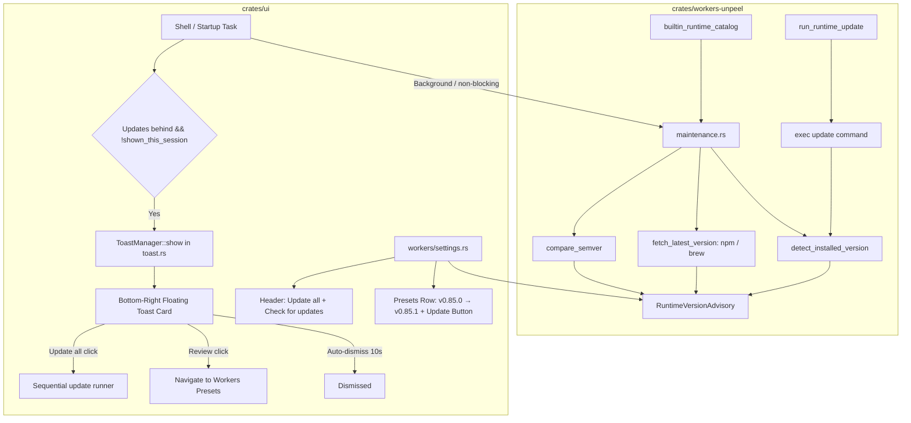

# Design: Worker CLI Maintenance and Startup Update Notifications

## Context

Comet launches and manages coding agents across multiple devices. The local workstation executes various agent CLIs via presets (`codex`, `claude`, `pi`, `omp`, `opencode`, `agy`). These CLIs frequently publish bugfixes and feature updates. Orchestrator.dev solved this with an end-to-end maintenance flow:
- Background probe of installed CLIs (`<binary> --version`).
- Install-source classification via symlink / realpath resolution.
- Registry querying (npm / Homebrew) with in-memory TTL caching.
- Semver comparison yielding `ProviderVersionAdvisory`.
- Floating bottom-right startup toast notifying the user once per app session.
- Rich settings UI listing version states with one-click update actions.

This design ports that architecture into Comet's native Rust and GPUI codebase.

## Architecture



## Key Modules

### 1. `crates/workers-unpeel/src/maintenance.rs`
- **Registry**: Associates known runtimes (`pi`, `omp`, `claude`, `codex`, `opencode`, `agy`) with:
  - `binary_name`
  - `npm_package`
  - `homebrew` (`name`, `cask` or `formula`)
  - `native_update` (e.g. `pi update`, `omp update`, `claude update`, `opencode upgrade`)
  - `probe_args` (e.g. `["--no-extensions", "--version"]` for OMP)
- **Install Source Classification**:
  - `npm`: path contains `/node_modules/.bin/` or `/lib/node_modules/`
  - `bun`: path contains `/.bun/bin/`
  - `pnpm`: path contains `/.local/share/pnpm/` or `/pnpm/global/`
  - `homebrew`: realpath contains `/Cellar/` or `/Caskroom/`
  - `native`: binary in `~/.local/bin/`
  - `unknown`: fallback to copyable manual command
- **Advisory Model**:
  ```rust
  pub enum RuntimeUpdateStatus {
      Unknown,
      Current,
      BehindLatest,
  }

  pub struct RuntimeVersionAdvisory {
      pub cli_id: String,
      pub status: RuntimeUpdateStatus,
      pub current_version: Option<String>,
      pub latest_version: Option<String>,
      pub update_command: Option<String>,
      pub can_update: bool,
  }
  ```
- **Update Execution**:
  - Guarded by in-flight locks per `cli_id` to prevent concurrent executions.
  - Spawns child process with timeout (5 minutes).
  - Captures stdout/stderr, re-runs detection, and returns `Succeeded`, `Unchanged`, or `Failed`.

### 2. `crates/ui/src/toast.rs`
- Floating overlay rendered in `Shell::render_overlays`.
- Container pinned to bottom-right:
  - Position: `bottom(px(16.0)).right(px(16.0))`
  - Animated entrance and auto-dismiss after configured duration (default 10s).
  - Rendered over all routes (Chat, Workers, Settings).
  - Handles action buttons (`Review`, `Update all`, dismiss).

### 3. `crates/ui/src/workers/settings.rs`
- Presets panel displays advisory badges:
  - When `BehindLatest`: shows `v{current} → v{latest}` and `[Update]` button.
  - When `Current`: shows `Current v{current}`.
  - Header actions: `Update all` when updates are pending, and `Check for updates` (`Rescan`).
