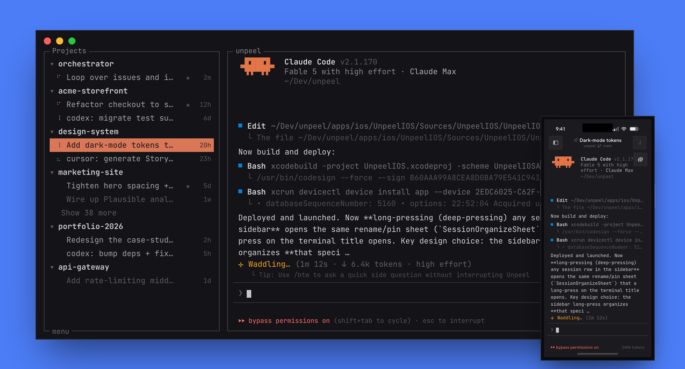

# Unpeel

**Your multiplexer for always-on terminal AI agents.**

File based and local-first. No account required for local use. Native on macOS
and in the terminal, built on Ghostty, with E2E-encrypted iPhone remote.

[](docs/assets/unpeel-demo.mp4)

▶ [Watch the demo](docs/assets/unpeel-demo.mp4)

Unpeel runs your CLI agents — Claude Code, Codex, Gemini, Pi, OpenCode,
Cursor Agent, Grok, Kimi, and anything else that lives in a terminal — as
**always-on hosted sessions** on hardware you own, steerable from a Mac, a
terminal, or your phone. It is a self-hosted alternative to cloud agent
platforms: same launch-from-anywhere, get-notified, review-and-steer loop,
while canonical session data stays on your machines. The optional Link relay
sees ciphertext only and never stores session content.

## Get it

**Mac app** — [unpeel.com/download/mac](https://unpeel.com/download/mac)

**CLI / headless (Mac or Linux)**

```bash
curl -fsSL https://unpeel.com/install.sh | sh
```

That installs `unpeel` (the terminal UI) and `unpeel-host`. The TUI is best
in [Ghostty](https://ghostty.org) — the same terminal engine Unpeel's own
surfaces use — but any modern terminal works. On a server, the
TUI *is* the host: it runs sessions, pairs your phone, and serves the same
remote protocol the Mac app does.

**iPhone / iPad** — [unpeel.com/ios](https://unpeel.com/ios)

## Why Unpeel

- **Always-on agents.** Every session runs in its own tiny host process,
  outside any window. Close the app, quit the terminal, reboot the UI — the
  agent keeps working, output is journaled in a bounded on-disk tail (roughly
  64–72 MiB of allocated storage for a chatty Session), and everything
  reattaches. Restart re-runs the agent with the right resume flag so the
  conversation continues.
- **One fleet, every CLI.** Provider-aware launch, resume, busy/idle/needs-
  attention state (driven by real hook integrations, not output guessing),
  auto-titling, pinning, projects, and git worktrees for parallel agents on
  one repo. Arbitrary shell commands work too.
- **Steer it from your phone.** The iPhone app is a real terminal over your
  sessions — pair with a QR code, get push notifications when an agent needs
  you, type back. Off-LAN traffic rides an end-to-end-encrypted relay; the
  relay can't read a byte of it.
- **Host anywhere, control from anywhere.** Macs and Linux boxes are hosts.
  iPhone controllers connect directly or through Link; terminal controllers
  use SSH. The native Mac Host picker is still a development preview. Every
  transport carries the same narrow Host contract.
- **Agents with superpowers.** Sessions get a built-in MCP server: inspect
  and message sibling sessions (with a real trust boundary), drive an
  isolated real browser per session, with screenshots saved as reviewable
  artifacts. Computer Use is temporarily kept out of production builds while
  its macOS permissions move behind a stronger security boundary.
- **Terminal-first, never an IDE.** GPU-rendered Ghostty terminals with
  links, images, and ligatures. No diff viewers, no file trees, no editor
  panes: agents are for *everything*, not just code, and the review surface
  is the terminal, transcripts, and screenshots.
- **Yours.** All state lives in `~/.unpeel/` as plain files. No account, no
  telemetry-driven cloud, no server product. The optional paid piece —
  Unpeel Link — is just the operated rendezvous/relay/push service for
  reaching your own machines from anywhere; everything local and direct is
  free.

## Open source

Everything you run is intended to be open, under the MIT license (the Unpeel
name and icon are trademarks — see `TRADEMARK.md`): the Mac app, the iOS app,
the terminal UI, the session backend, the relay, the protocols, and the docs.
The only closed component is the backend of the operated Unpeel Link service
(accounts, seats, entitlements, rendezvous) — you pay for infrastructure we
run, never for a checkbox in a binary you compiled yourself. The full
boundary, reasoning, and pre-publication checklist live in
[`docs/plans/open-source.md`](docs/plans/open-source.md).

## Repo layout

| path | what it is |
| --- | --- |
| `apps/native` | The macOS app (Swift + libghostty) and the `unpeel-attach` terminal client |
| `apps/ios` | The iPhone/iPad controller app |
| `apps/shared` | Swift package: pairing, remote-control, and relay E2E protocol shared by both Apple clients |
| `crates/unpeel-core` | The session backend: PTY hosting, provider integrations, hooks, MCP, transcripts |
| `crates/unpeel-host` | The standalone host binary (session host, MCP server, remote server) |
| `crates/unpeel-tui` | `unpeel` — the terminal UI and headless host |
| `apps/relay` | The Link relay worker: E2E-opaque transport + push |
| `apps/website` | unpeel.com (site, docs, purchase UI) |
| `apps/releases` | Download/update distribution worker (Sparkle appcasts, installer) |

Each directory has its own README; `AGENTS.md` is the deep map of how the
session system fits together.

## How sessions survive

Each session is a separate `unpeel-host` process owning the PTY. It writes
`output.bin` (bounded sparse journal with monotonic logical offsets), serves
`session.sock` (control), and
persists `manifest.json` under `~/.unpeel/app-sessions/<id>/`. Clients —
Mac app, TUI, phone — are attachments over that state, so any of them can
restart without touching the agent. App-level state (projects, presets,
pins, theme) is one JSON file: `~/.unpeel/app-state.json`.

## Development

With Bun and Rust installed, fetch the JavaScript workspace dependencies:

```bash
bun install
```

**CLI / TUI**

Build both terminal-side binaries, then run the development TUI from the
repository root:

```bash
cargo build --manifest-path crates/Cargo.toml -p unpeel-tui -p unpeel-host
crates/target/debug/unpeel
```

`unpeel-host` must be built alongside `unpeel`: the TUI launches that sibling
binary to own its hosted sessions. By default, the development TUI shares the
normal state in `~/.unpeel`. To test against isolated disposable state instead:

```bash
UNPEEL_HOME=/tmp/unpeel-dev crates/target/debug/unpeel
```

**Other development targets**

```bash
bun run dev:native      # macOS app: builds, signs stably, launches dist/Unpeel.app
bun run dev:website     # unpeel.com dev server
cargo test --manifest-path crates/Cargo.toml   # backend tests
```

> Use `bun run dev:native` rather than a bare `swift run`: it signs with a
> stable local identity so macOS keeps trusting the app's Keychain access
> across rebuilds. See `AGENTS.md` ▸ "Local Development Builds".

The TUI has a real-PTY integration suite: `crates/unpeel-tui/tests/run.sh`.

## Releases

The Mac app and CLI share one version but have separate publication steps.
`bun run release -- --channel <ch> --build <n>` builds, signs, notarizes, and
publishes the Sparkle-updatable Mac app; `bun run release:cli` publishes the
Mac/Linux CLI tarballs. Artifacts live on Cloudflare R2 behind unpeel.com.
Details: `docs/agents/releases.md`.
